# 🔌 API Inventory & Sequence Diagrams (ฉบับสกัดจากโค้ดจริง)

> เอกสารนี้รวบรวม **API endpoint ทุกเส้น** ที่ระบบ Smart Pricing & Quotation ใช้งานจริง สแกนจากโค้ด
> - Backend: `@router.<method>("...")` ใน 26 ไฟล์ + prefix จาก `main.py`
> - Frontend: `api.<method>(...)` + `fetch(...)` ใน `frontend/src`

ลำดับเอกสาร
1. [API Inventory แบ่งตาม Domain (12 หมวด)](#-1-api-inventory-แบ่งตาม-domain)
2. [Frontend ↔ Backend Mapping (caller จริง)](#-2-frontend--backend-mapping)
3. [Prompts สำหรับสร้าง Sequence Diagram](#-3-prompts-สำหรับสร้าง-sequence-diagram)
4. [Mermaid Sequence Diagrams 12 ชุด พร้อมใช้](#-4-mermaid-sequence-diagrams-พร้อมใช้)

---

## 📋 1. API Inventory แบ่งตาม Domain

> หมายเหตุ Prefix สุดท้าย = `prefix ใน main.py` + `prefix ในไฟล์ router` (ดู `backend/main.py`)

### 1.1 🔐 Authentication (`/api/login`) — file: `login.py`

| # | Method | Path | Function | ใช้โดย |
|---|--------|------|----------|--------|
| 1 | POST | `/api/login/init` | `init_from_uxp` | UXP SSO callback |
| 2 | POST | `/api/login/select-branch` | `select_branch` | เลือกสาขา multi-branch |
| 3 | POST | `/api/login` | `login` | login พื้นฐาน |
| 4 | POST | `/api/login/manual` | `manual_login` | login ด้วย username/password |
| 5 | GET | `/api/login/me` | `get_current_user` | ดึง user ปัจจุบัน |
| 6 | POST | `/api/login/logout` | `logout` | ออกจากระบบ |
| 7 | GET | `/api/login/roles` | `get_roles` | dropdown role |
| 8 | GET | `/api/login/branches` | `get_branches` | dropdown branch |

### 1.2 📋 Quotation (`/api/quotation`) — file: `quotation.py`

| # | Method | Path | Function |
|---|--------|------|----------|
| 9 | POST | `/api/quotation` | `create_quotation` |
| 10 | PUT | `/api/quotation/{quote_no}` | `update_quotation` |
| 11 | GET | `/api/quotation` | `list_quotations` (filter ?status=) |
| 12 | GET | `/api/quotation/dashboard-stats` | `get_dashboard_stats` |
| 13 | GET | `/api/quotation/{quote_no}` | `get_quotation` (detail) |
| 14 | DELETE | `/api/quotation/{quote_no}` | `cancel_quotation` |
| 15 | POST | `/api/quotation/{quote_no}/reorder` | `reorder_quotation` |
| 16 | GET | `/api/quotation/pre-order/{branch_code}` | `get_preorder_quotes` |

### 1.3 💰 Pricing & Special Price

**Pricing engine** (`/api/pricing`) — file: `pricing_router.py`

| # | Method | Path | Function |
|---|--------|------|----------|
| 17 | POST | `/api/pricing/calculate` | `calculate_pricing` |

**Special Price Request** (`/api/special-price-requests`) — file: `special_price_request_router.py`

| # | Method | Path | Function |
|---|--------|------|----------|
| 18 | GET | `/api/special-price-requests/approver-info` | `get_approver_info` |
| 19 | GET | `/api/special-price-requests/pm-by-categories` | `get_pm_by_categories` |
| 20 | GET | `/api/special-price-requests/quote/{quote_no}` | `get_special_price_request_by_quote` |
| 21 | GET | `/api/special-price-requests/active-prices/{customer_code}` | `get_active_special_prices` |
| 22 | GET | `/api/special-price-requests/pending/approvals` | `get_pending_approvals` |
| 23 | POST | `/api/special-price-requests` | `create_special_price_request` |
| 24 | POST | `/api/special-price-requests/{request_id}/approve` | `approve_request` |
| 25 | POST | `/api/special-price-requests/{request_id}/reject` | `reject_request` |

**Promotion** (`/api/promotions`) — file: `promotion_router.py`

| # | Method | Path | Function |
|---|--------|------|----------|
| 26 | POST | `/api/promotions` | `create_promotion` |
| 27 | POST | `/api/promotions/get-skus-by-filter` | `get_skus_by_filter` |
| 28 | GET | `/api/promotions` | `get_promotions` |
| 29 | GET | `/api/promotions/active-by-customer` | `get_active_promotions_by_customer` |
| 30 | GET | `/api/promotions/active-by-skus` | `get_active_promotions_by_skus` |
| 31 | PUT | `/api/promotions/{promotion_id}/status` | `update_promotion_status` |
| 32 | DELETE | `/api/promotions/{promotion_id}` | `delete_promotion` |

**Project Price** (`/api/project-prices`) — file: `project_price_router.py`

| # | Method | Path | Function |
|---|--------|------|----------|
| 33 | POST | `/api/project-prices` | `create_project_price` |
| 34 | GET | `/api/project-prices/next-code/{mode}` | `get_next_project_code` |
| 35 | GET | `/api/project-prices` | `get_project_prices` |
| 36 | GET | `/api/project-prices/active-by-customer-sku` | `get_active_project_price` |
| 37 | GET | `/api/project-prices/by-customer` | `get_projects_by_customer` |
| 38 | GET | `/api/project-prices/project-prices/{project_id}` | `get_project_prices_by_id` |
| 39 | PUT | `/api/project-prices/{project_id}/status` | `update_project_status` |
| 40 | PUT | `/api/project-prices/{project_id}` | `update_project_price` |
| 41 | DELETE | `/api/project-prices/{project_id}` | `delete_project_price` |
| 42 | GET | `/api/project-prices/customer/{customer_code}/all` | `get_all_projects_by_customer` |
| 43 | GET | `/api/project-prices/branch/{branch_code}/all` | `get_all_projects_by_branch` |

**Project Files** (`/api/project-files`) — file: `project_files_router.py`

| # | Method | Path | Function |
|---|--------|------|----------|
| 44 | POST | `/api/project-files/upload/{project_code}` | `upload_project_file` |

**Bulk Price Update** (`/api/item-update`) — file: `price_update.py`

| # | Method | Path | Function |
|---|--------|------|----------|
| 45 | POST | `/api/item-update/upload` | `upload_price_excel` |
| 46 | GET | `/api/item-update/preview/{version_id}` | `preview_version` |
| 47 | POST | `/api/item-update/activate/{version_id}` | `activate_version` |

**External Price API** (`/api/external/prices`) — file: `external_price_api_router.py`

| # | Method | Path | Function |
|---|--------|------|----------|
| 48 | POST | `/api/external/prices/update` | `update_single_price` |
| 49 | POST | `/api/external/prices/bulk-update` | `bulk_update_prices` |
| 50 | GET | `/api/external/prices/status/{version_id}` | `get_version_status` |

### 1.4 📦 Catalog & Items (`/api/items`) — file: `items.py`

| # | Method | Path | Function |
|---|--------|------|----------|
| 51 | GET | `/api/items/categories/list` | `get_item_categories` |
| 52 | GET | `/api/items/categories/{category_name}/list` | `get_items_list_light` |
| 53 | GET | `/api/items/list` | `get_items_paginated` |
| 54 | GET | `/api/items/search` | `full_text_search_items` |
| 55 | GET | `/api/items/{sku}` | `get_item_detail` |
| 56 | GET | `/api/items/related/{sku}` | `get_related_items` |
| 57 | GET | `/api/items/categories/{category_name}/filter-options` | `get_filter_options` |
| 58 | GET | `/api/items/{sku}/stock` | `get_item_stock` |
| 59 | GET | `/api/items/glass/list` | `get_glass_list` |
| 60 | POST | `/api/items/glass/calc` | `calc_glass` |
| 61 | GET | `/api/items/glass/filter-options` | `get_glass_filter_options` |
| 62 | GET | `/api/items/glass/{sku}/stock` | `get_glass_stock` |

### 1.5 🤝 Cross-Sell (`/api/cross-sell`) — file: `cross_sell_router.py`

| # | Method | Path | Function |
|---|--------|------|----------|
| 63 | POST | `/api/cross-sell` | `cross_sell_endpoint` |

### 1.6 🖼️ Product Images (`/api/product-images`) — file: `product_image_router.py`

| # | Method | Path | Function |
|---|--------|------|----------|
| 64 | POST | `/api/product-images/upload/{sku}` | `upload_product_image` |
| 65 | GET | `/api/product-images/{sku}` | `get_product_image` |
| 66 | DELETE | `/api/product-images/{sku}` | `delete_product_image` |
| 67 | GET | `/api/product-images` | `list_product_images` |

### 1.7 👥 Customer & Analytics

**Customer** (`/api/customer`) — file: `customer.py`

| # | Method | Path | Function |
|---|--------|------|----------|
| 68 | GET / POST | `/api/customer/search` | `search_customer` |
| 69 | GET / POST | `/api/customer/list` | `search_customer_list_v2` |
| 70 | GET / POST | `/api/customer/search-list` | `search_customer_list` (deprecated) |
| 71 | GET | `/api/customer/{customer_id}` | `get_customer_by_id` |
| 72 | GET | `/api/customer/all/customers` | `get_all_customers` (paginated) |

**Customer Analytics** (`/api/customer-analytics`) — file: `customer_analytics.py`

| # | Method | Path | Function |
|---|--------|------|----------|
| 73 | GET | `/api/customer-analytics/monthly-summary` | `customer_monthly_summary` |
| 74 | GET | `/api/customer-analytics/category-summary` | `customer_category_summary` |

**Credit** (no prefix) — file: `credit_router.py`

| # | Method | Path | Function |
|---|--------|------|----------|
| 75 | GET | `/api/credit-status/{customer_id}` | `get_credit_status` |
| 76 | GET | `/api/remaining-credit/{customer_id}` | `get_remaining_credit` |

### 1.8 🚚 Shipping (`/api/shipping`) — file: `shipping.py`

| # | Method | Path | Function |
|---|--------|------|----------|
| 77 | POST | `/api/shipping/calculate` | `calculate_shipping` |
| 78 | POST | `/api/shipping/calculate_from_cart` | `calculate_shipping_from_cart` |

### 1.9 🧾 Invoice (`/api/invoice`) — file: `invoice_router.py`

| # | Method | Path | Function |
|---|--------|------|----------|
| 79 | GET | `/api/invoice/list` | `list_invoice` |
| 80 | GET | `/api/invoice/item-price-history` | `item_price_history` |
| 81 | GET | `/api/invoice/{document_no}` | `get_invoice` |

### 1.10 🏢 Master Data

**Branch** (`/api/branches`) — file: `branch.py`

| # | Method | Path | Function |
|---|--------|------|----------|
| 82 | GET | `/api/branches` | `get_branches` |
| 83 | GET | `/api/branches/regions` | `get_regions` |

**Employees** (`/api/employees`) — file: `employees.py`

| # | Method | Path | Function |
|---|--------|------|----------|
| 84 | GET | `/api/employees` | `list_employees` |
| 85 | GET | `/api/employees/{code}` | `get_employee` |

### 1.11 ⚙️ Admin / Config / Cache

**Config** (`/api/config`) — file: `config_router.py`

| # | Method | Path | Function |
|---|--------|------|----------|
| 86 | GET | `/api/config/settings` | `get_config` |
| 87 | PUT | `/api/config/settings` | `update_config` |
| 88 | GET | `/api/config/roles` | `get_available_roles` |
| 89 | POST | `/api/config/roles` | `create_role` |
| 90 | DELETE | `/api/config/roles/{role_code}` | `delete_role` |
| 91 | GET | `/api/config/page-access/check/{page_id}` | `check_page_access_endpoint` |
| 92 | GET | `/api/config/page-access/user-pages` | `get_user_pages` |
| 93 | GET | `/api/config/regions` | `get_region_mapping` |
| 94 | PUT | `/api/config/regions/{region_code}` | `update_region_manager` |
| 95 | POST | `/api/config/validate-folder` | `validate_folder_path` |

**Admin** (`/api/admin`) — file: `admin_router.py`

| # | Method | Path | Description |
|---|--------|------|-------------|
| 96 | GET | `/api/admin/...` | admin endpoints (RBAC, settings) |

**Cache Refresh** (`/api/cache`) — file: `cache_refresh_router.py`

| # | Method | Path | Function |
|---|--------|------|----------|
| 97 | GET | `/api/cache/refresh-status` | `get_refresh_status` |
| 98 | POST | `/api/cache/refresh-customer-cache` | `trigger_customer_cache_refresh` |
| 99 | GET | `/api/cache/scheduler-status` | `get_scheduler_status` |

**Statistics** (`/api/statistics`) — file: `statistics_router.py`

| # | Method | Path | Function |
|---|--------|------|----------|
| 100 | GET | `/api/statistics/current` | `get_current_statistics` |
| 101 | POST | `/api/statistics/refresh` | `refresh_statistics` |
| 102 | GET | `/api/statistics/cache-info` | `get_statistics_cache_info` |
| 103 | DELETE | `/api/statistics/cache` | `clear_statistics_cache_endpoint` |

### 1.12 🤖 RPA / Print / Health

**Chrome Debug** (`/api/chrome-debug`) — file: `chrome_debug_router.py`

| # | Method | Path | Function |
|---|--------|------|----------|
| 104 | POST | `/api/chrome-debug/start` | `start_chrome_debug` |

**RPA Agent** (external HTTP service, not FastAPI) — file: `rpa_agent/rpa_agent.py`

| # | Method | URL | Description |
|---|--------|-----|-------------|
| 105 | POST | `http://localhost:8001/...` | สร้าง SalesQuote ใน D365 BC ผ่าน Selenium |

**Print** — file: `print_router.py`

| # | Method | Path | Function |
|---|--------|------|----------|
| 106 | POST | `/api/print/quotation` | `print_quotation` (PDF) |

**Health** — file: `main.py`

| # | Method | Path | Function |
|---|--------|------|----------|
| 107 | GET | `/api/health` | `health_check` |

> **รวมทั้งหมด: 107 endpoints**


---

## 🔗 2. Frontend ↔ Backend Mapping

> สแกนจาก `api.<method>(...)` และ `fetch(...)` ในไฟล์ `frontend/src/**`

### 2.1 Page-by-Page (เรียงตาม flow user)

#### 🟢 `Login.jsx`

| Method | Endpoint | Backend |
|--------|----------|---------|
| GET | `/api/login/roles` | `login.py: get_roles` |
| GET | `/api/login/branches` | `login.py: get_branches` |
| POST | `/api/login/init` | `login.py: init_from_uxp` |
| POST | `/api/login/manual` | `login.py: manual_login` |
| POST | `/api/login/select-branch` | `login.py: select_branch` |

#### 🟢 `StartPage.jsx`

| Method | Endpoint | Backend |
|--------|----------|---------|
| POST | `${BASE}/api/chrome-debug/start` (fetch) | `chrome_debug_router.py: start_chrome_debug` |

#### 🟢 `Dashboard.jsx`

| Method | Endpoint | Backend |
|--------|----------|---------|
| GET | `/api/config/page-access/user-pages` | `config_router.py` |
| GET | `/api/quotation/dashboard-stats` | `quotation.py: get_dashboard_stats` |
| GET | `/api/special-price-requests/pending/approvals` | `special_price_request_router.py` |

#### 🟢 `CreateQuoteWizard.jsx` → `Step6_Summary.jsx` (Single-Page Quote Builder)

> **หมายเหตุ:** ปัจจุบันหน้า CreateQuote เป็น **single-page** ไม่ใช่ wizard แบบแยก step — `CreateQuoteWizard.jsx` เป็นแค่ wrapper บาง ๆ ที่ load draft แล้ว render `Step6_Summary.jsx` (ไฟล์ใหญ่ ~2700 บรรทัด) ซึ่งรวม sections ทั้งหมดไว้ในหน้าเดียว: Customer Search, Item Picker, Cart, Pricing, Shipping, Summary, Print

| Method | Endpoint | Backend | ใช้ใน Component |
|--------|----------|---------|-----------------|
| GET / POST | `/api/customer/search` | `customer.py: search_customer` | `CustomerSearchSection` |
| POST | `/api/customer/search-list?q=` | `customer.py: search_customer_list` | `CustomerSearch.jsx` |
| GET | `/api/customer/list` | `customer.py: search_customer_list_v2` | autocomplete |
| GET | `/api/items/categories/list` | `items.py: get_item_categories` | `CategoryCard` |
| GET | `/api/items/categories/{c}/list` | `items.py: get_items_list_light` | `ProductList` |
| GET | `/api/items/search` | `items.py: full_text_search_items` | `ItemPickerModal`, search bar |
| GET | `/api/items/{sku}` | `items.py: get_item_detail` | item detail |
| GET | `/api/items/{sku}/stock` | `items.py: get_item_stock` | `useStep6Stock`, `getItemStock` ใน api.js |
| GET | `/api/items/related/{sku}` | `items.py: get_related_items` | similar items |
| GET | `/api/items/categories/{c}/filter-options` | `items.py: get_filter_options` | filter |
| GET | `/api/items/glass/list` | `items.py: get_glass_list` | `GlassPickerModal` |
| POST | `/api/items/glass/calc` | `items.py: calc_glass` | คำนวณกระจก |
| GET | `/api/items/glass/filter-options` | `items.py: get_glass_filter_options` | `GlassPickerModal` |
| GET | `/api/items/glass/{sku}/stock` | `items.py: get_glass_stock` | stock กระจก |
| POST | `/api/pricing/calculate` | `pricing_router.py: calculate_pricing` | `useStep6Pricing` hook |
| POST | `/api/shipping/calculate_from_cart` | `shipping.py: calculate_shipping_from_cart` | `TaxDeliverySection` |
| POST | `/api/quotation` | `quotation.py: create_quotation` | save button |
| PUT | `/api/quotation/{id}` | `quotation.py: update_quotation` | update draft |
| GET | `/api/quotation` | `quotation.py: list_quotations` | history filter |
| GET | `/api/quotation/{quote_no}` | `quotation.py: get_quotation` | edit draft |
| GET | `/api/quotation?status=complete` | `quotation.py: list_quotations` | order history |
| POST | `/api/quotation/{quote_no}/reorder` | `quotation.py: reorder_quotation` | reorder |
| GET | `/api/special-price-requests/quote/{quote_no}` | special price | `useStep6Data` |
| GET | `/api/special-price-requests/active-prices/{customer_code}` | special price | `useStep6Data` |
| POST | `/api/special-price-requests` | special price create | special price flow |
| GET | `/api/promotions/active-by-skus` | `promotion_router.py` | promotion check |
| GET | `/api/project-prices/by-customer` | `project_price_router.py` | project selector |
| GET | `/api/credit-status/{id}` | `credit_router.py` | credit check |
| GET | `/api/remaining-credit/{id}` | `credit_router.py` | credit check |
| GET | `/api/branches` | `branch.py: get_branches` | branch selector |
| GET | `/api/config/settings` | `config_router.py: get_config` | VAT rate |
| GET | `/api/invoice/item-price-history` | `invoice_router.py` | `useItemPriceHistory` |
| POST | `/api/cross-sell` | `cross_sell_router.py` | `CrossSellPanel` |
| POST | `http://localhost:8001/...` (fetch) | `rpa_agent.py` | RPA send-to-BC button |
| POST | `/api/print/quotation` (fetch) | `print_router.py` | print PDF button |

#### 🟢 `ConfirmedQuotesPage.jsx` / `QuoteDraftListPage.jsx` / `OrderDetailPage.jsx` / `CustomerDetail.jsx` / `CustomerPerDay.jsx`

| Method | Endpoint | Backend |
|--------|----------|---------|
| GET | `/api/quotation?status=...` | `quotation.py: list_quotations` |
| GET | `/api/quotation/{id}` | `quotation.py: get_quotation` |
| DELETE | `/api/quotation/{id}` | `quotation.py: cancel_quotation` |
| POST | `/api/quotation/{id}/reorder` | `quotation.py: reorder_quotation` |
| POST | `/api/print/quotation` (fetch) | `print_router.py` |
| GET | `/api/customer/{id}` | `customer.py: get_customer_by_id` |
| GET | `/api/customer/list` | `customer.py: search_customer_list_v2` |
| GET | `/api/credit-status/{id}` | `credit_router.py` |
| GET | `/api/remaining-credit/{id}` | `credit_router.py` |

#### 🟢 `UpdatePrice.jsx` + `UploadPriceExcel.jsx`

| Method | Endpoint | Backend |
|--------|----------|---------|
| GET | `/api/config/page-access/check/update_price` | `config_router.py` |
| POST | `/api/item-update/upload` | `price_update.py: upload_price_excel` |
| GET | `/api/item-update/preview/{version_id}` | `price_update.py: preview_version` |
| POST | `/api/item-update/activate/{version_id}` | `price_update.py: activate_version` |

#### 🟢 `ProjectPrice.jsx` + `ProjectPriceManagement.jsx`

| Method | Endpoint | Backend |
|--------|----------|---------|
| GET | `/api/config/page-access/check/project_price` | `config_router.py` |
| GET | `/api/config/settings` | `config_router.py` (project_code_mode) |
| GET | `/api/employees?q=` | `employees.py: list_employees` |
| GET | `/api/employees/{code}` | `employees.py: get_employee` |
| GET | `/api/branches` | `branch.py: get_branches` |
| GET | `/api/project-prices` | `project_price_router.py: get_project_prices` |
| POST | `/api/project-prices` | `project_price_router.py: create_project_price` |
| PUT | `/api/project-prices/{id}` | `project_price_router.py: update_project_price` |
| PUT | `/api/project-prices/{id}/status` | `project_price_router.py: update_project_status` |
| POST | `/api/project-files/upload/{code}` | `project_files_router.py: upload_project_file` |
| POST | `/api/promotions/get-skus-by-filter` | `promotion_router.py` (re-used) |
| GET | `/api/items/glass/filter-options` | `items.py: get_glass_filter_options` |
| POST | `/api/customer/search?code=` | `customer.py: search_customer` |

#### 🟢 `PromotionManagement.jsx`

| Method | Endpoint | Backend |
|--------|----------|---------|
| GET | `/api/promotions` | `promotion_router.py: get_promotions` |
| POST | `/api/promotions` | `promotion_router.py: create_promotion` |
| POST | `/api/promotions/get-skus-by-filter` | `promotion_router.py: get_skus_by_filter` |
| PUT | `/api/promotions/{id}/status` | `promotion_router.py: update_promotion_status` |
| DELETE | `/api/promotions/{id}` | `promotion_router.py: delete_promotion` |
| GET | `/api/branches` | `branch.py` |
| GET | `/api/items/search` | `items.py` |

#### 🟢 `SpecialPriceApproval.jsx`

| Method | Endpoint | Backend |
|--------|----------|---------|
| GET | `/api/config/page-access/check/special_price_approval` | `config_router.py` |
| GET | `/api/special-price-requests/pending/approvals` | `special_price_request_router.py` |
| POST | `/api/special-price-requests/{id}/approve` | `special_price_request_router.py: approve_request` |
| POST | `/api/special-price-requests/{id}/reject` | `special_price_request_router.py: reject_request` |

#### 🟢 `AdminConfig.jsx`

| Method | Endpoint | Backend |
|--------|----------|---------|
| GET | `/api/config/settings` | `config_router.py: get_config` |
| PUT | `/api/config/settings` | `config_router.py: update_config` |
| GET | `/api/config/roles` | `config_router.py: get_available_roles` |
| POST | `/api/config/roles` | `config_router.py: create_role` |
| DELETE | `/api/config/roles/{role}` | `config_router.py: delete_role` |
| GET | `/api/config/regions` | `config_router.py: get_region_mapping` |
| PUT | `/api/config/regions/{code}` | `config_router.py: update_region_manager` |
| POST | `/api/config/validate-folder` | `config_router.py: validate_folder_path` |

#### 🟢 `ProductImageManager.jsx`

| Method | Endpoint | Backend |
|--------|----------|---------|
| GET (fetch) | `/api/product-images/{sku}` | `product_image_router.py: get_product_image` |
| POST | `/api/product-images/upload/{sku}` | `product_image_router.py: upload_product_image` |
| DELETE | `/api/product-images/{sku}` | `product_image_router.py: delete_product_image` |


---

## 🎯 3. Prompts สำหรับสร้าง Sequence Diagram

### 3.1 Master Prompt (ใช้กับ ChatGPT / Claude / Gemini)

````text
คุณเป็น Software Architect ขอให้สร้าง Sequence Diagram (รูปแบบ Mermaid `sequenceDiagram`)
จากข้อมูล API endpoints ของระบบ "Smart Pricing & Quotation System" ด้านล่างนี้

## SYSTEM ARCHITECTURE
- Frontend: React 19 + Vite + Axios (port 3200/5173)
- Backend: FastAPI + Uvicorn (port 8000)
- Database: MSSQL Server (Primary) + SQLite (fallback)
- RPA: rpa_agent.py (HTTP server :8001) → Selenium → Chrome (:9222) → D365 BC
- External: Business Central API, Employee API, Customer API, Invoice API
- Auth: JWT (Bearer + Cookie) ผ่าน auth_dependency.get_branch_code()

## PARTICIPANTS (กำหนดชื่อสั้นใน Mermaid)
actor U as User
participant FE as React SPA
participant API as FastAPI :8000
participant DB as MSSQL
participant BC as D365 BC
participant RPA as RPA Agent :8001
participant CHR as Chrome :9222

## STYLE GUIDE
- ใช้ `sequenceDiagram` syntax ของ Mermaid
- ทุก message ระบุ HTTP method + path เช่น `FE->>API: POST /api/pricing/calculate`
- ใช้ `Note over X,Y: ...` สำหรับ business rule
- ใช้ `alt / else / end` สำหรับเงื่อนไข
- ใช้ `loop ... end` สำหรับ iteration
- ใช้ `par ... and ... end` สำหรับ parallel call
- ใช้ `autonumber` ที่ต้นไดอะแกรม
- ภาษา label ผสมไทย-อังกฤษได้ตามต้นฉบับ
- ห้ามใช้ () ใน arrow label (ใช้ "via", "with" แทน)

## YOUR TASK
สร้าง Sequence Diagram สำหรับ flow ต่อไปนี้:
[ระบุชื่อ flow / scenario]

## API REFERENCES (สำหรับ flow นี้)
[paste จาก section 1 หรือ 2 ของไฟล์ API_INVENTORY_AND_SEQUENCE.md]

## OUTPUT
1. Mermaid code block พร้อม render
2. คำอธิบายสั้นใต้รูป (2-3 บรรทัด)
3. Edge cases / error path (ถ้ามี)
````

### 3.2 Quick Prompt Templates (1 บรรทัดต่อ flow)

| # | Flow | Prompt สั้น |
|---|------|------------|
| 1 | Login | `วาด Sequence Diagram flow Login (UXP SSO + Manual + Select Branch) แสดง endpoint /api/login/init, /api/login/manual, /api/login/select-branch + JWT generation → Mermaid` |
| 2 | Dashboard | `วาด Sequence Diagram flow โหลด Dashboard (3 API parallel: page-access/user-pages, dashboard-stats, pending/approvals) → Mermaid` |
| 3 | Create Quote | `วาด Sequence Diagram flow Create Quote 6 steps แสดง customer search, items, pricing, shipping, save, print → Mermaid` |
| 4 | Pricing | `วาด Sequence Diagram flow /api/pricing/calculate แสดง priority: ProjectPrice > SpecialPrice > Promotion > Tier (R1/R2/W1/W2) → Mermaid` |
| 5 | Special Price | `วาด Sequence Diagram flow Special Price Request: Sales create → PM/SDM approve via /approve และ /reject → Mermaid` |
| 6 | Project Price | `วาด Sequence Diagram flow Project Price Management: next-code → create → upload-file → list → status update → Mermaid` |
| 7 | Promotion | `วาด Sequence Diagram flow Promotion: get-skus-by-filter → create promotion → toggle status → Mermaid` |
| 8 | Bulk Price Upload | `วาด Sequence Diagram flow Excel Price Upload: /api/item-update/upload → preview → activate version → Mermaid` |
| 9 | RPA Send-to-BC | `วาด Sequence Diagram flow Send Quote to D365 BC: POST /api/chrome-debug/start → POST localhost:8001 → Selenium → Chrome :9222 → BC → Mermaid` |
| 10 | Print PDF | `วาด Sequence Diagram flow Print Quotation PDF (frontend pdf-lib + backend /api/print/quotation + WeasyPrint) → Mermaid` |
| 11 | Reorder | `วาด Sequence Diagram flow Reorder: POST /api/quotation/{id}/reorder ตรวจสอบหมดอายุ + คำนวณราคาใหม่ → Mermaid` |
| 12 | Cache Refresh | `วาด Sequence Diagram flow Cache Refresh: APScheduler/Airflow → /api/cache/refresh-customer-cache → BC API → MSSQL → Mermaid` |
| 13 | Page Access (RBAC) | `วาด Sequence Diagram flow ตรวจสิทธิ์เข้าหน้า: GET /api/config/page-access/check/{page_id} → ตรวจ JWT role → page_access_config.json → Mermaid` |
| 14 | Customer 360 | `วาด Sequence Diagram flow Customer Detail page: customer/{id} + quotation list 4 status + credit-status + remaining-credit → Mermaid` |
| 15 | Glass Picker | `วาด Sequence Diagram flow GlassPickerModal: filter-options → glass/list → glass/calc → glass/{sku}/stock → Mermaid` |

### 3.3 Prompt สำหรับสร้าง "ภาพรวม API ทุกเส้น"

````text
จาก endpoint ทั้ง 107 เส้นด้านล่าง สร้าง Mermaid flowchart LR
ที่แสดงการเชื่อมโยง Frontend Page (15 หน้า) → API Endpoint → Backend Router (26 ไฟล์)
- Group โดยใช้ subgraph 3 ชั้น: FE / API / BE
- Edge label = HTTP method + path
- ใช้ classDef แยกสีตาม domain (Auth/Quote/Pricing/Catalog/Master/Admin/RPA)
[paste section 1 ทั้งหมด]
````


---

## 🧬 4. Mermaid Sequence Diagrams พร้อมใช้

> ทุกอันสามารถ paste ลง <https://mermaid.live> แล้ว render ได้ทันที
> หลีกเลี่ยง `()` ใน arrow label เพื่อไม่ให้ parser พัง

### Sequence #1 — Login (UXP SSO + Manual + Select Branch)

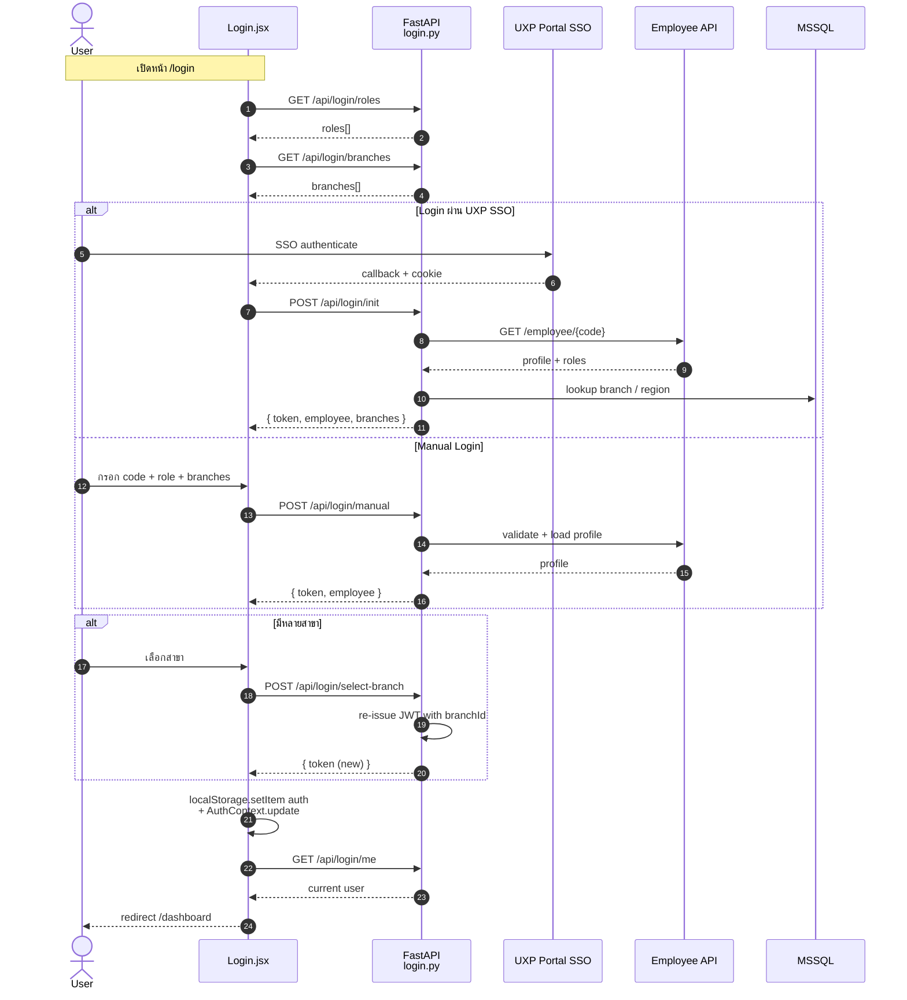
```mermaid
sequenceDiagram
    autonumber
    actor U as User
    participant FE as Login.jsx
    participant API as FastAPI<br/>login.py
    participant UXP as UXP Portal SSO
    participant EAPI as Employee API
    participant DB as MSSQL

    Note over U,FE: เปิดหน้า /login
    FE->>API: GET /api/login/roles
    API-->>FE: roles[]
    FE->>API: GET /api/login/branches
    API-->>FE: branches[]

    alt Login ผ่าน UXP SSO
        U->>UXP: SSO authenticate
        UXP-->>FE: callback + cookie
        FE->>API: POST /api/login/init
        API->>EAPI: GET /employee/{code}
        EAPI-->>API: profile + roles
        API->>DB: lookup branch / region
        API-->>FE: { token, employee, branches }
    else Manual Login
        U->>FE: กรอก code + role + branches
        FE->>API: POST /api/login/manual
        API->>EAPI: validate + load profile
        EAPI-->>API: profile
        API-->>FE: { token, employee }
    end

    alt มีหลายสาขา
        U->>FE: เลือกสาขา
        FE->>API: POST /api/login/select-branch
        API->>API: re-issue JWT with branchId
        API-->>FE: { token (new) }
    end

    FE->>FE: localStorage.setItem auth<br/>+ AuthContext.update
    FE->>API: GET /api/login/me
    API-->>FE: current user
    FE-->>U: redirect /dashboard
```

---

### Sequence #2 — Dashboard Load

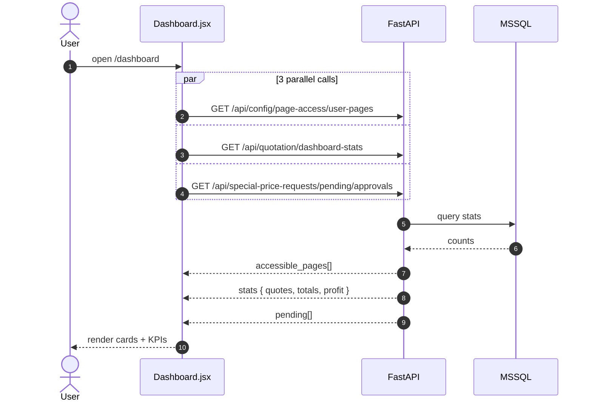
```mermaid
sequenceDiagram
    autonumber
    actor U as User
    participant FE as Dashboard.jsx
    participant API as FastAPI
    participant DB as MSSQL

    U->>FE: open /dashboard
    par 3 parallel calls
        FE->>API: GET /api/config/page-access/user-pages
    and
        FE->>API: GET /api/quotation/dashboard-stats
    and
        FE->>API: GET /api/special-price-requests/pending/approvals
    end

    API->>DB: query stats
    DB-->>API: counts
    API-->>FE: accessible_pages[]
    API-->>FE: stats { quotes, totals, profit }
    API-->>FE: pending[]

    FE-->>U: render cards + KPIs
```

---

### Sequence #3 — Create Quote (Single-Page Builder)

> **หมายเหตุ:** ปัจจุบันเป็น single-page (Step6_Summary.jsx) ไม่ใช่ wizard แบบแยก step — ทุก section อยู่ในหน้าเดียว

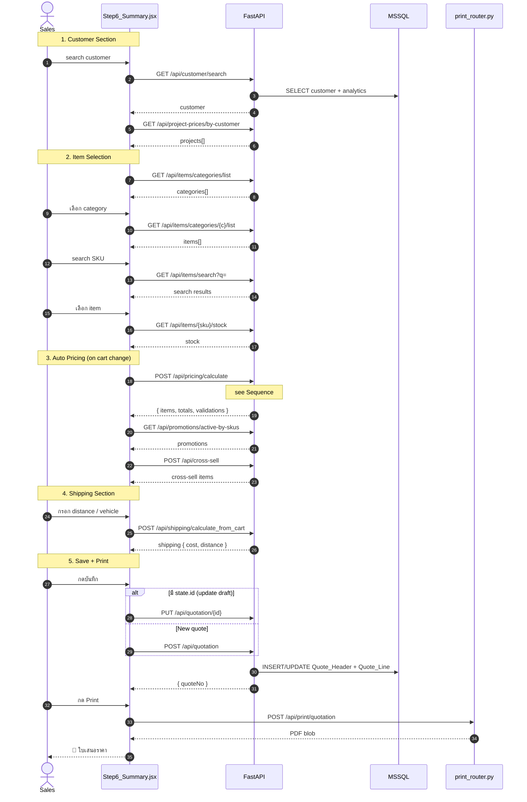
```mermaid
sequenceDiagram
    autonumber
    actor S as Sales
    participant FE as Step6_Summary.jsx
    participant API as FastAPI
    participant DB as MSSQL
    participant Print as print_router.py

    Note over S,FE: 1. Customer Section
    S->>FE: search customer
    FE->>API: GET /api/customer/search
    API->>DB: SELECT customer + analytics
    API-->>FE: customer
    FE->>API: GET /api/project-prices/by-customer
    API-->>FE: projects[]

    Note over S,FE: 2. Item Selection
    FE->>API: GET /api/items/categories/list
    API-->>FE: categories[]
    S->>FE: เลือก category
    FE->>API: GET /api/items/categories/{c}/list
    API-->>FE: items[]
    S->>FE: search SKU
    FE->>API: GET /api/items/search?q=
    API-->>FE: search results
    S->>FE: เลือก item
    FE->>API: GET /api/items/{sku}/stock
    API-->>FE: stock

    Note over S,FE: 3. Auto Pricing (on cart change)
    FE->>API: POST /api/pricing/calculate
    Note over API: see Sequence #4 for priority
    API-->>FE: { items, totals, validations }
    FE->>API: GET /api/promotions/active-by-skus
    API-->>FE: promotions
    FE->>API: POST /api/cross-sell
    API-->>FE: cross-sell items

    Note over S,FE: 4. Shipping Section
    S->>FE: กรอก distance / vehicle
    FE->>API: POST /api/shipping/calculate_from_cart
    API-->>FE: shipping { cost, distance }

    Note over S,FE: 5. Save + Print
    S->>FE: กดบันทึก
    alt มี state.id (update draft)
        FE->>API: PUT /api/quotation/{id}
    else New quote
        FE->>API: POST /api/quotation
    end
    API->>DB: INSERT/UPDATE Quote_Header + Quote_Line
    API-->>FE: { quoteNo }

    S->>FE: กด Print
    FE->>Print: POST /api/print/quotation
    Print-->>FE: PDF blob
    FE-->>S: 📄 ใบเสนอราคา
```

---

### Sequence #4 — Pricing Calculation Priority

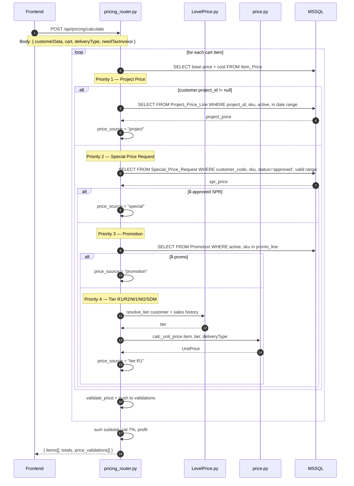
```mermaid
sequenceDiagram
    autonumber
    participant FE as Frontend
    participant API as pricing_router.py
    participant Lvl as LevelPrice.py
    participant Pc as price.py
    participant DB as MSSQL

    FE->>API: POST /api/pricing/calculate
    Note over FE,API: Body: { customerData, cart, deliveryType, needTaxInvoice }

    loop for each cart item
        API->>DB: SELECT base price + cost FROM Item_Price

        Note over API: Priority 1 — Project Price
        alt customer.project_id != null
            API->>DB: SELECT FROM Project_Price_Line WHERE project_id, sku, active, in date range
            DB-->>API: project_price
            API->>API: price_source = "project"
        else
            Note over API: Priority 2 — Special Price Request
            API->>DB: SELECT FROM Special_Price_Request WHERE customer_code, sku, status='approved', valid range
            DB-->>API: spr_price
            alt มี approved SPR
                API->>API: price_source = "special"
            else
                Note over API: Priority 3 — Promotion
                API->>DB: SELECT FROM Promotion WHERE active, sku in promo_line
                alt มี promo
                    API->>API: price_source = "promotion"
                else
                    Note over API: Priority 4 — Tier R1/R2/W1/W2/SDM
                    API->>Lvl: resolve_tier customer + sales history
                    Lvl-->>API: tier
                    API->>Pc: calc_unit_price item, tier, deliveryType
                    Pc-->>API: UnitPrice
                    API->>API: price_source = "tier:R1"
                end
            end
        end
        API->>API: validate_price + push to validations
    end

    API->>API: sum subtotal, vat 7%, profit
    API-->>FE: { items[], totals, price_validations[] }
```

---

### Sequence #5 — Special Price Request

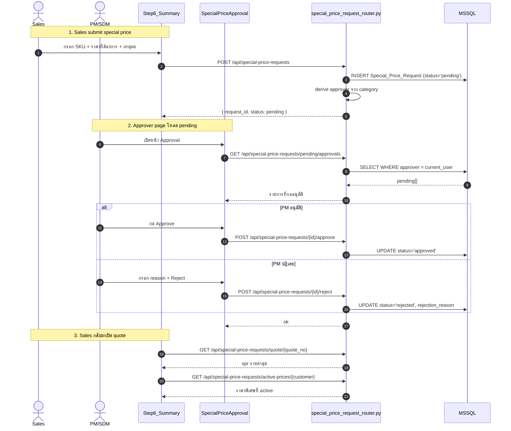
```mermaid
sequenceDiagram
    autonumber
    actor S as Sales
    actor PM as PM/SDM
    participant FE_S as Step6_Summary
    participant FE_A as SpecialPriceApproval
    participant API as special_price_request_router.py
    participant DB as MSSQL

    Note over S,FE_S: 1. Sales submit special price
    S->>FE_S: กรอก SKU + ราคาที่ต้องการ + เหตุผล
    FE_S->>API: POST /api/special-price-requests
    API->>DB: INSERT Special_Price_Request (status='pending')
    API->>API: derive approver จาก category
    API-->>FE_S: { request_id, status: pending }

    Note over PM,FE_A: 2. Approver page โหลด pending
    PM->>FE_A: เปิดหน้า Approval
    FE_A->>API: GET /api/special-price-requests/pending/approvals
    API->>DB: SELECT WHERE approver = current_user
    DB-->>API: pending[]
    API-->>FE_A: รายการที่รออนุมัติ

    alt PM อนุมัติ
        PM->>FE_A: กด Approve
        FE_A->>API: POST /api/special-price-requests/{id}/approve
        API->>DB: UPDATE status='approved'
    else PM ปฏิเสธ
        PM->>FE_A: กรอก reason + Reject
        FE_A->>API: POST /api/special-price-requests/{id}/reject
        API->>DB: UPDATE status='rejected', rejection_reason
    end
    API-->>FE_A: ok

    Note over S,FE_S: 3. Sales กลับมาเปิด quote
    FE_S->>API: GET /api/special-price-requests/quote/{quote_no}
    API-->>FE_S: spr รายล่าสุด
    FE_S->>API: GET /api/special-price-requests/active-prices/{customer}
    API-->>FE_S: ราคาพิเศษที่ active
```

---

### Sequence #6 — Project Price Management

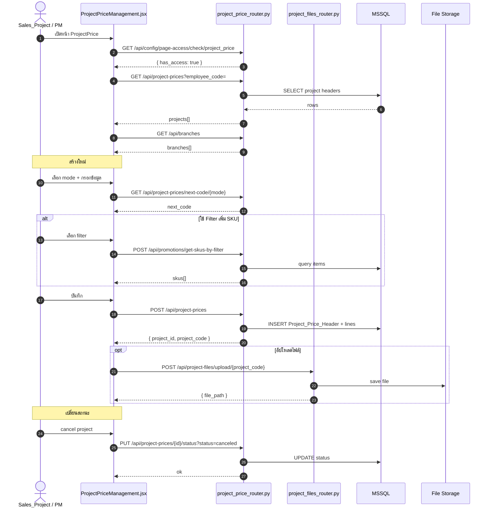
```mermaid
sequenceDiagram
    autonumber
    actor U as Sales_Project / PM
    participant FE as ProjectPriceManagement.jsx
    participant API as project_price_router.py
    participant Files as project_files_router.py
    participant DB as MSSQL
    participant FS as File Storage

    U->>FE: เปิดหน้า ProjectPrice
    FE->>API: GET /api/config/page-access/check/project_price
    API-->>FE: { has_access: true }

    FE->>API: GET /api/project-prices?employee_code=
    API->>DB: SELECT project headers
    DB-->>API: rows
    API-->>FE: projects[]

    FE->>API: GET /api/branches
    API-->>FE: branches[]

    Note over U,FE: สร้างใหม่
    U->>FE: เลือก mode + กรอกข้อมูล
    FE->>API: GET /api/project-prices/next-code/{mode}
    API-->>FE: next_code

    alt ใช้ Filter เพิ่ม SKU
        U->>FE: เลือก filter
        FE->>API: POST /api/promotions/get-skus-by-filter
        API->>DB: query items
        API-->>FE: skus[]
    end

    U->>FE: บันทึก
    FE->>API: POST /api/project-prices
    API->>DB: INSERT Project_Price_Header + lines
    API-->>FE: { project_id, project_code }

    opt อัปโหลดไฟล์
        FE->>Files: POST /api/project-files/upload/{project_code}
        Files->>FS: save file
        Files-->>FE: { file_path }
    end

    Note over U,FE: เปลี่ยนสถานะ
    U->>FE: cancel project
    FE->>API: PUT /api/project-prices/{id}/status?status=canceled
    API->>DB: UPDATE status
    API-->>FE: ok
```

---

### Sequence #7 — Promotion Management

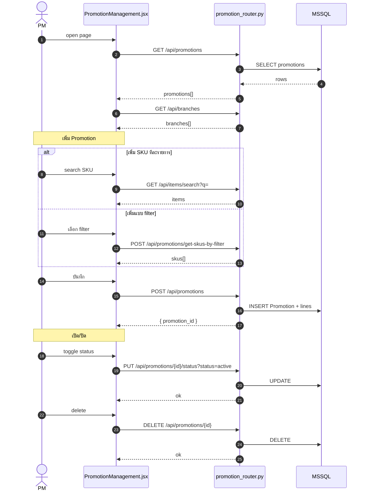
```mermaid
sequenceDiagram
    autonumber
    actor PM as PM
    participant FE as PromotionManagement.jsx
    participant API as promotion_router.py
    participant DB as MSSQL

    PM->>FE: open page
    FE->>API: GET /api/promotions
    API->>DB: SELECT promotions
    DB-->>API: rows
    API-->>FE: promotions[]
    FE->>API: GET /api/branches
    API-->>FE: branches[]

    Note over PM,FE: เพิ่ม Promotion
    alt เพิ่ม SKU ทีละรายการ
        PM->>FE: search SKU
        FE->>API: GET /api/items/search?q=
        API-->>FE: items
    else เพิ่มแบบ filter
        PM->>FE: เลือก filter
        FE->>API: POST /api/promotions/get-skus-by-filter
        API-->>FE: skus[]
    end

    PM->>FE: บันทึก
    FE->>API: POST /api/promotions
    API->>DB: INSERT Promotion + lines
    API-->>FE: { promotion_id }

    Note over PM,FE: เปิด/ปิด
    PM->>FE: toggle status
    FE->>API: PUT /api/promotions/{id}/status?status=active
    API->>DB: UPDATE
    API-->>FE: ok

    PM->>FE: delete
    FE->>API: DELETE /api/promotions/{id}
    API->>DB: DELETE
    API-->>FE: ok
```

---

### Sequence #8 — Bulk Price Upload (Excel)

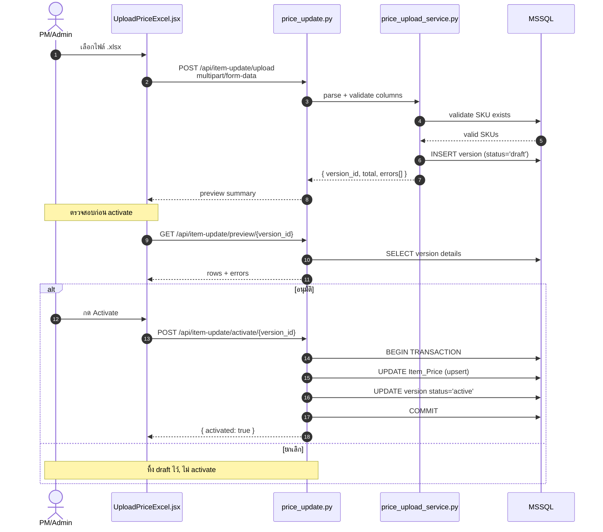
```mermaid
sequenceDiagram
    autonumber
    actor PM as PM/Admin
    participant FE as UploadPriceExcel.jsx
    participant API as price_update.py
    participant Svc as price_upload_service.py
    participant DB as MSSQL

    PM->>FE: เลือกไฟล์ .xlsx
    FE->>API: POST /api/item-update/upload<br/>multipart/form-data
    API->>Svc: parse + validate columns
    Svc->>DB: validate SKU exists
    DB-->>Svc: valid SKUs
    Svc->>DB: INSERT version (status='draft')
    Svc-->>API: { version_id, total, errors[] }
    API-->>FE: preview summary

    Note over PM,FE: ตรวจสอบก่อน activate
    FE->>API: GET /api/item-update/preview/{version_id}
    API->>DB: SELECT version details
    API-->>FE: rows + errors

    alt อนุมัติ
        PM->>FE: กด Activate
        FE->>API: POST /api/item-update/activate/{version_id}
        API->>DB: BEGIN TRANSACTION
        API->>DB: UPDATE Item_Price (upsert)
        API->>DB: UPDATE version status='active'
        API->>DB: COMMIT
        API-->>FE: { activated: true }
    else ยกเลิก
        Note over PM,API: ทิ้ง draft ไว้, ไม่ activate
    end
```

---

### Sequence #9 — RPA Send-to-BC

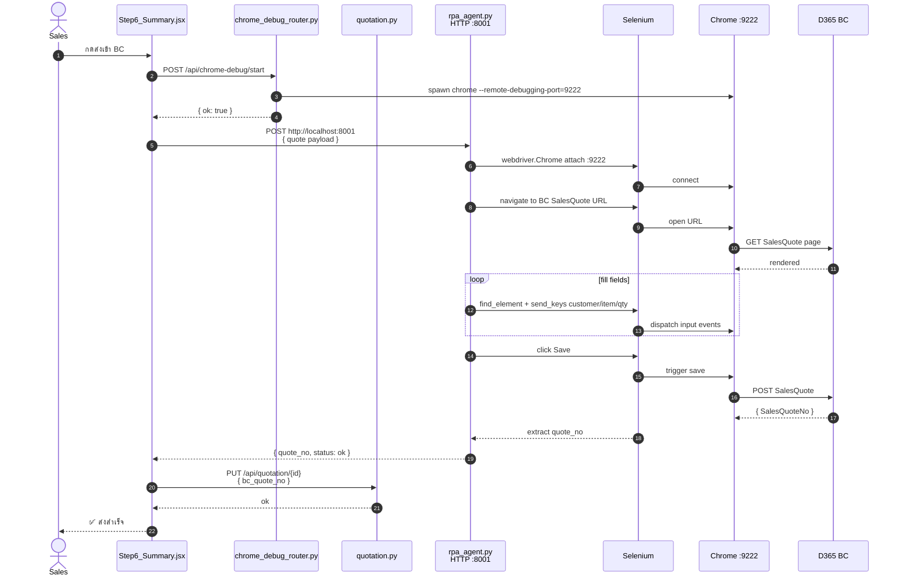
```mermaid
sequenceDiagram
    autonumber
    actor S as Sales
    participant FE as Step6_Summary.jsx
    participant Dbg as chrome_debug_router.py
    participant Q as quotation.py
    participant RPA as rpa_agent.py<br/>HTTP :8001
    participant Sel as Selenium
    participant Chr as Chrome :9222
    participant BC as D365 BC

    S->>FE: กดส่งเข้า BC
    FE->>Dbg: POST /api/chrome-debug/start
    Dbg->>Chr: spawn chrome --remote-debugging-port=9222
    Dbg-->>FE: { ok: true }

    FE->>RPA: POST http://localhost:8001<br/>{ quote payload }
    RPA->>Sel: webdriver.Chrome attach :9222
    Sel->>Chr: connect
    RPA->>Sel: navigate to BC SalesQuote URL
    Sel->>Chr: open URL
    Chr->>BC: GET SalesQuote page
    BC-->>Chr: rendered

    loop fill fields
        RPA->>Sel: find_element + send_keys customer/item/qty
        Sel->>Chr: dispatch input events
    end

    RPA->>Sel: click Save
    Sel->>Chr: trigger save
    Chr->>BC: POST SalesQuote
    BC-->>Chr: { SalesQuoteNo }
    Sel-->>RPA: extract quote_no
    RPA-->>FE: { quote_no, status: ok }

    FE->>Q: PUT /api/quotation/{id}<br/>{ bc_quote_no }
    Q-->>FE: ok
    FE-->>S: ✅ ส่งสำเร็จ #SO-12345
```

---

### Sequence #10 — Print Quotation PDF

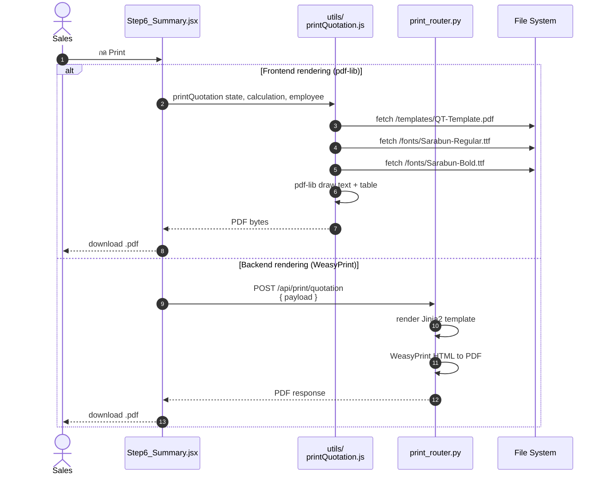
```mermaid
sequenceDiagram
    autonumber
    actor S as Sales
    participant FE as Step6_Summary.jsx
    participant Util as utils/<br/>printQuotation.js
    participant API as print_router.py
    participant FS as File System

    S->>FE: กด Print
    alt Frontend rendering (pdf-lib)
        FE->>Util: printQuotation state, calculation, employee
        Util->>FS: fetch /templates/QT-Template.pdf
        Util->>FS: fetch /fonts/Sarabun-Regular.ttf
        Util->>FS: fetch /fonts/Sarabun-Bold.ttf
        Util->>Util: pdf-lib draw text + table
        Util-->>FE: PDF bytes
        FE-->>S: download .pdf
    else Backend rendering (WeasyPrint)
        FE->>API: POST /api/print/quotation<br/>{ payload }
        API->>API: render Jinja2 template
        API->>API: WeasyPrint HTML to PDF
        API-->>FE: PDF response
        FE-->>S: download .pdf
    end
```

---

### Sequence #11 — Reorder

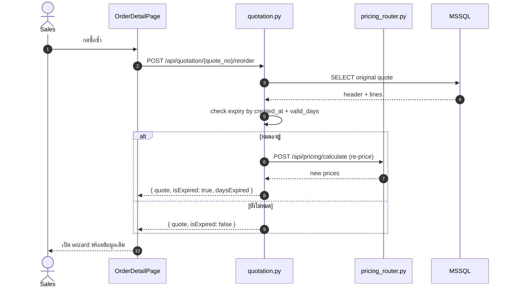
```mermaid
sequenceDiagram
    autonumber
    actor S as Sales
    participant FE as OrderDetailPage
    participant Q as quotation.py
    participant Pr as pricing_router.py
    participant DB as MSSQL

    S->>FE: กดซื้อซ้ำ
    FE->>Q: POST /api/quotation/{quote_no}/reorder
    Q->>DB: SELECT original quote
    DB-->>Q: header + lines
    Q->>Q: check expiry by created_at + valid_days

    alt หมดอายุ
        Q->>Pr: POST /api/pricing/calculate (re-price)
        Pr-->>Q: new prices
        Q-->>FE: { quote, isExpired: true, daysExpired }
    else ยังไม่หมด
        Q-->>FE: { quote, isExpired: false }
    end
    FE-->>S: เปิด wizard พร้อมข้อมูลเดิม
```

---

### Sequence #12 — Cache Refresh (Customer)

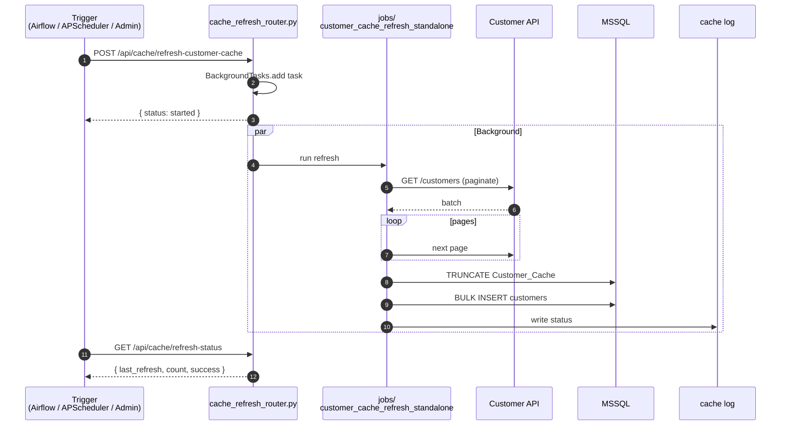
```mermaid
sequenceDiagram
    autonumber
    participant Trg as Trigger<br/>(Airflow / APScheduler / Admin)
    participant API as cache_refresh_router.py
    participant Job as jobs/<br/>customer_cache_refresh_standalone
    participant CAPI as Customer API
    participant DB as MSSQL
    participant Log as cache log

    Trg->>API: POST /api/cache/refresh-customer-cache
    API->>API: BackgroundTasks.add task
    API-->>Trg: { status: started }

    par Background
        API->>Job: run refresh
        Job->>CAPI: GET /customers (paginate)
        CAPI-->>Job: batch
        loop pages
            Job->>CAPI: next page
        end
        Job->>DB: TRUNCATE Customer_Cache
        Job->>DB: BULK INSERT customers
        Job->>Log: write status
    end

    Trg->>API: GET /api/cache/refresh-status
    API-->>Trg: { last_refresh, count, success }
```

---

### Sequence #13 — Page Access Check (RBAC)

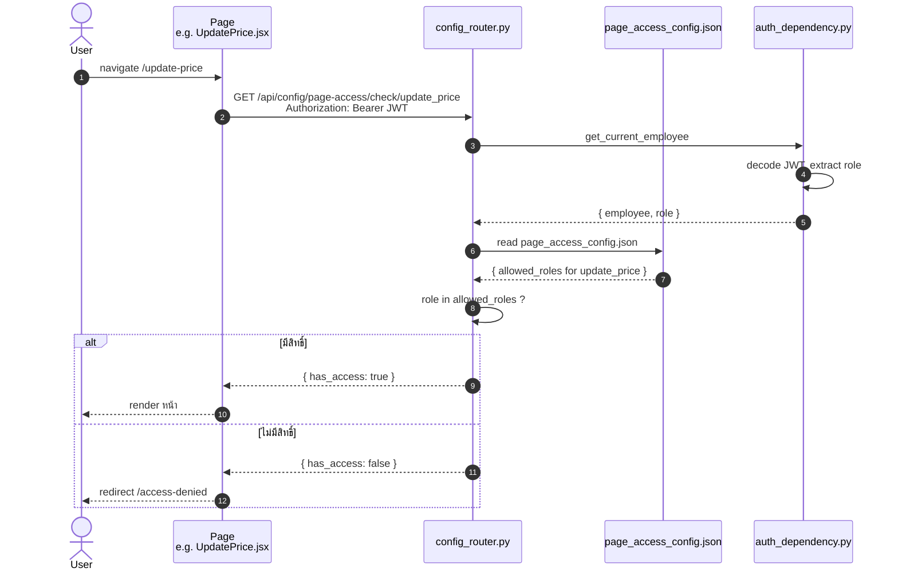
```mermaid
sequenceDiagram
    autonumber
    actor U as User
    participant FE as Page<br/>e.g. UpdatePrice.jsx
    participant API as config_router.py
    participant Cfg as page_access_config.json
    participant Auth as auth_dependency.py

    U->>FE: navigate /update-price
    FE->>API: GET /api/config/page-access/check/update_price<br/>Authorization: Bearer JWT
    API->>Auth: get_current_employee
    Auth->>Auth: decode JWT, extract role
    Auth-->>API: { employee, role }
    API->>Cfg: read page_access_config.json
    Cfg-->>API: { allowed_roles for update_price }
    API->>API: role in allowed_roles ?

    alt มีสิทธิ์
        API-->>FE: { has_access: true }
        FE-->>U: render หน้า
    else ไม่มีสิทธิ์
        API-->>FE: { has_access: false }
        FE-->>U: redirect /access-denied
    end
```

---

### Sequence #14 — Customer 360 (CustomerDetail)

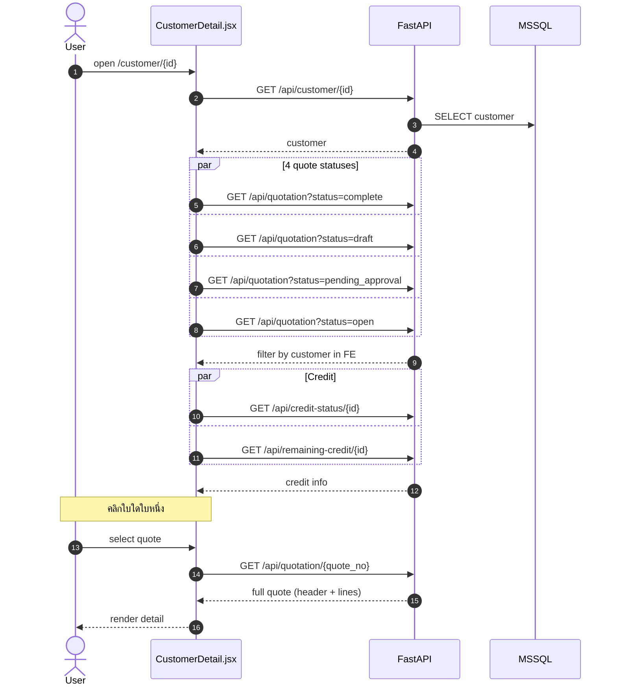
```mermaid
sequenceDiagram
    autonumber
    actor U as User
    participant FE as CustomerDetail.jsx
    participant API as FastAPI
    participant DB as MSSQL

    U->>FE: open /customer/{id}
    FE->>API: GET /api/customer/{id}
    API->>DB: SELECT customer
    API-->>FE: customer

    par 4 quote statuses
        FE->>API: GET /api/quotation?status=complete
    and
        FE->>API: GET /api/quotation?status=draft
    and
        FE->>API: GET /api/quotation?status=pending_approval
    and
        FE->>API: GET /api/quotation?status=open
    end
    API-->>FE: filter by customer in FE

    par Credit
        FE->>API: GET /api/credit-status/{id}
    and
        FE->>API: GET /api/remaining-credit/{id}
    end
    API-->>FE: credit info

    Note over U,FE: คลิกใบใดใบหนึ่ง
    U->>FE: select quote
    FE->>API: GET /api/quotation/{quote_no}
    API-->>FE: full quote (header + lines)
    FE-->>U: render detail
```

---

### Sequence #15 — Glass Picker

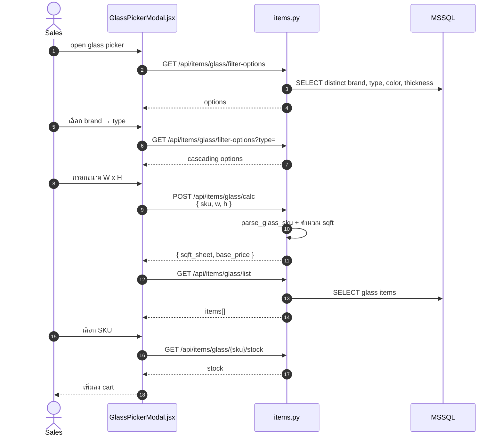
```mermaid
sequenceDiagram
    autonumber
    actor S as Sales
    participant FE as GlassPickerModal.jsx
    participant API as items.py
    participant DB as MSSQL

    S->>FE: open glass picker
    FE->>API: GET /api/items/glass/filter-options
    API->>DB: SELECT distinct brand, type, color, thickness
    API-->>FE: options

    S->>FE: เลือก brand → type
    FE->>API: GET /api/items/glass/filter-options?type=
    API-->>FE: cascading options

    S->>FE: กรอกขนาด W x H
    FE->>API: POST /api/items/glass/calc<br/>{ sku, w, h }
    API->>API: parse_glass_sku + คำนวณ sqft
    API-->>FE: { sqft_sheet, base_price }

    FE->>API: GET /api/items/glass/list
    API->>DB: SELECT glass items
    API-->>FE: items[]

    S->>FE: เลือก SKU
    FE->>API: GET /api/items/glass/{sku}/stock
    API-->>FE: stock
    FE-->>S: เพิ่มลง cart
```

---

## 🚀 วิธีใช้งาน

### Render เป็นรูป
1. คัดลอก code block แต่ละ Sequence ไปวางที่ <https://mermaid.live>
2. กด Export → SVG / PNG / PDF
3. หรือเปิดไฟล์นี้ใน VSCode (extension `Markdown Preview Mermaid Support`) → กด `Ctrl+Shift+V`

### ใช้ Master Prompt
1. เปิด ChatGPT / Claude / Gemini
2. ใส่ Master Prompt (section 3.1)
3. แทนที่ `[ระบุชื่อ flow]` ด้วย flow ที่ต้องการ + paste API references
4. รับ Mermaid code มา paste ใน mermaid.live

### Export ทุก diagram เป็น PDF เดียว
```bash
npm install -g @mermaid-js/mermaid-cli
mmdc -i API_INVENTORY_AND_SEQUENCE.md -o sequences.pdf
```

---

**ผู้จัดทำ:** Smart Pricing Engineering Team
**อัปเดตล่าสุด:** May 2026
**สแกนจากโค้ด:** backend ทุก router + frontend `api.*` และ `fetch()` calls
**ไฟล์เกี่ยวข้อง:** `DIAGRAM_GENERATION_GUIDE.md`, `COMPLETE_SYSTEM_ARCHITECTURE.md`, `STEP6_API_FLOW_DOCUMENTATION.md`
