# 📊 Create Quote - Complete Sequence Diagram

> **Sequence Diagram แบบละเอียดสำหรับ CreateQuote Flow**  
> สแกนจากโค้ดจริงใน `Step6_Summary.jsx` (~2700 บรรทัด)

---

## 🎯 Overview

**หน้า CreateQuote** เป็น **Single-Page Builder** ที่รวมทุก section ไว้ในหน้าเดียว:
- `CreateQuoteWizard.jsx` = wrapper บาง ๆ (load drafts)
- `Step6_Summary.jsx` = main component ที่มีทุกอย่าง

**Sections ใน Step6_Summary:**
1. CustomerSearchSection (ค้นหาลูกค้า)
2. ItemPickerModal + GlassPickerModal (เลือกสินค้า)
3. Cart + Auto Pricing (ตะกร้า + คำนวณราคาอัตโนมัติ)
4. TaxDeliverySection (จัดส่ง + VAT)
5. CrossSellPanel (สินค้าแนะนำ)
6. Summary + Save + Print (สรุปและบันทึก)

---

## 🔄 Complete Sequence Diagram

```mermaid
sequenceDiagram
    autonumber
    actor Sales as 👤 Sales
    participant Wizard as CreateQuoteWizard.jsx
    participant Step6 as Step6_Summary.jsx<br/>(Single-Page Builder)
    participant CustSec as CustomerSearchSection
    participant ItemModal as ItemPickerModal
    participant GlassModal as GlassPickerModal
    participant TaxDel as TaxDeliverySection
    participant CrossSell as CrossSellPanel
    participant API as FastAPI :8000
    participant DB as MSSQL
    participant Print as print_router.py
    participant RPA as RPA Agent :8001

    Note over Sales,Wizard: 🚀 PHASE 1: เปิดหน้า CreateQuote
    Sales->>Wizard: navigate to /create-quote
    Note over Wizard: ดึง draft จาก location.state เท่านั้น
    Note over Wizard: ไม่มีการยิง API ใดๆ ใน CreateQuoteWizard
    alt มี draft ส่งมาจากหน้า QuoteDraftListPage
        Wizard->>Wizard: dispatch LOAD_DRAFT from location.state
    end
    Wizard->>Step6: render with state

    Note over Sales,Step6: 📋 PHASE 2: Load Initial Data
    Step6->>API: GET /api/items/categories/list
    API->>DB: SELECT DISTINCT category
    DB-->>API: categories[]
    API-->>Step6: ["G", "A", "C", "Y", "S", "E"]

    Step6->>API: GET /api/config/settings
    API-->>Step6: { vatRate: 0.07, ... }

    Note over Sales,CustSec: 👥 PHASE 3: Customer Selection
    Sales->>CustSec: search customer
    CustSec->>API: GET /api/customer/search?code={code}
    API->>DB: SELECT customer + analytics
    DB-->>API: customer { code, name, tier, sales_*_cust, ... }
    API-->>CustSec: customer

    alt Customer has projects
        Step6->>API: GET /api/project-prices/by-customer?customerCode={code}
        API->>DB: SELECT FROM Project_Price_Header WHERE customer
        DB-->>API: projects[]
        API-->>Step6: projects
        Sales->>Step6: select project
        Step6->>Step6: setSelectedProject(project_id)
    end

    alt Load customer history
        Step6->>API: GET /api/quotation?status=complete
        API->>DB: SELECT WHERE customer_code
        DB-->>API: history_orders[]
        API-->>Step6: history
        opt Sales clicks repeat order
            Sales->>Step6: repeat from history
            Step6->>Step6: dispatch ADD_TO_CART from history
        end
    end

    Note over Sales,ItemModal: 🛒 PHASE 4: Product Selection

    alt Browse by Category
        Sales->>Step6: select category "G"
        Step6->>API: GET /api/items/categories/G/list
        API->>DB: SELECT WHERE category='G'
        DB-->>API: items[]
        API-->>Step6: items
        Sales->>ItemModal: open item picker
        ItemModal->>API: GET /api/items/categories/G/filter-options
        API-->>ItemModal: { brands[], types[], ... }
        Sales->>ItemModal: apply filters
        ItemModal->>API: GET /api/items/list?category=G&brand=...
        API-->>ItemModal: filtered_items[]
    end

    alt Search Product
        Sales->>Step6: type search "กระจก"
        Step6->>API: GET /api/items/search?q=กระจก
        API->>DB: FULLTEXT SEARCH
        DB-->>API: search_results[]
        API-->>Step6: results
    end

    alt Select Glass (Special Flow)
        Sales->>GlassModal: open glass picker
        GlassModal->>API: GET /api/items/glass/filter-options
        API->>DB: SELECT DISTINCT brand, type, color, thickness
        DB-->>API: glass_options
        API-->>GlassModal: options
        Sales->>GlassModal: select brand → type → color → thickness
        GlassModal->>API: GET /api/items/glass/filter-options?type=...
        API-->>GlassModal: cascading options
        Sales->>GlassModal: input W x H (e.g., 100 x 200)
        GlassModal->>API: POST /api/items/glass/calc<br/>{ sku, width: 100, height: 200 }
        API->>API: parse_glass_sku + calculate sqft
        API-->>GlassModal: { sqft_sheet, base_price }
        GlassModal->>API: GET /api/items/glass/list
        API-->>GlassModal: glass_items[]
    end

    Sales->>Step6: select item + qty
    Step6->>API: GET /api/items/{sku}/stock
    API->>DB: SELECT stock
    DB-->>API: { available, reserved }
    API-->>Step6: stock
    Step6->>Step6: dispatch ADD_TO_CART<br/>{ sku, qty, needsPricing: true }

    Note over Sales,Step6: 💰 PHASE 5: Auto Pricing Calculation

    Step6->>Step6: useEffect detect cart change
    Step6->>API: POST /api/pricing/calculate
    Note over Step6,API: Body: {<br/>  customerData: { code, tier, sales_*_cust, project_id },<br/>  deliveryType,<br/>  needTaxInvoice,<br/>  cart: [{ sku, qty, sqft_sheet, ... }]<br/>}

    API->>DB: SELECT base_price FROM Item_Price

    loop for each cart item
        Note over API: Priority 1 — Project Price
        alt project_id != null
            API->>DB: SELECT FROM Project_Price_Line<br/>WHERE project_id, sku, active
            DB-->>API: project_price
            API->>API: price_source = "project"
        else
            Note over API: Priority 2 — Special Price Request
            API->>DB: SELECT FROM Special_Price_Request<br/>WHERE customer, sku, status='approved'
            DB-->>API: spr_price
            alt has approved SPR
                API->>API: price_source = "special"
            else
                Note over API: Priority 3 — Promotion
                API->>DB: SELECT FROM Promotion WHERE active
                alt has promotion
                    API->>API: price_source = "promotion"
                else
                    Note over API: Priority 4 — Tier (R1/R2/W1/W2/SDM)
                    API->>API: LevelPrice.resolve_tier(customer)
                    API->>API: price.calc_unit_price(item, tier, deliveryType)
                    API->>API: price_source = "tier:R1"
                end
            end
        end
        API->>API: validate_price + push to validations[]
    end

    API->>API: calculate subtotal, vat (7%), total, profit
    API-->>Step6: { items[], totals, price_validations[] }
    Step6->>Step6: setCalculation(result)

    alt Load Promotions
        Step6->>API: GET /api/promotions/active-by-skus?skus={sku1,sku2}
        API->>DB: SELECT FROM Promotion WHERE sku IN (...)
        DB-->>API: promotions[]
        API-->>Step6: promotions
        Step6->>Step6: show PromotionBanner
    end

    alt Load Cross-Sell
        Step6->>CrossSell: render with cart
        CrossSell->>API: POST /api/cross-sell<br/>{ cart: [...] }
        API->>DB: SELECT FROM Cross_Sell_Rules
        DB-->>API: cross_sell_items[]
        API-->>CrossSell: suggestions
        CrossSell-->>Sales: แสดงสินค้าแนะนำ
    end

    Note over Sales,TaxDel: 🚚 PHASE 6: Shipping & Tax Configuration

    Sales->>TaxDel: configure delivery
    TaxDel->>TaxDel: select deliveryType (pickup/delivery)
    
    alt Delivery (not pickup)
        Sales->>TaxDel: input distance, vehicle, unload hours
        TaxDel->>API: POST /api/shipping/calculate_from_cart
        Note over TaxDel,API: Body: {<br/>  vehicle_type,<br/>  distance_km,<br/>  unload_hours,<br/>  staff_count,<br/>  cart: [...]<br/>}
        API->>API: calculate shipping cost
        API-->>TaxDel: { cost, breakdown }
        TaxDel->>Step6: update shippingCustomerPay
        Step6->>API: POST /api/pricing/calculate (re-calculate with shipping)
        API-->>Step6: updated totals
    end

    Sales->>TaxDel: toggle needsTax (ใบกำกับภาษี)
    alt needsTax = true
        TaxDel->>Step6: set needsTax
        Step6->>API: POST /api/pricing/calculate (with needTaxInvoice: true)
        API->>API: add tax invoice surcharge
        API-->>Step6: updated totals with surcharge
    end

    Sales->>TaxDel: set required delivery date
    TaxDel->>Step6: setRequiredDeliveryDate(date)

    Note over Sales,Step6: ⚠️ PHASE 7: Price Validation & Special Price Request

    alt มีสินค้าราคาต่ำกว่า R1
        Step6->>Step6: detect items below R1 from validations[]
        Step6-->>Sales: แสดง warning banner
        Sales->>Step6: click "ขอราคาพิเศษ"
        Step6->>Step6: open SpecialPriceRequestModal
        Sales->>Step6: input reason + approver
        Step6->>API: POST /api/special-price-requests
        Note over Step6,API: Body: {<br/>  customer_code,<br/>  items: [{ sku, requested_price, reason }],<br/>  approver_code,<br/>  quote_no<br/>}
        API->>DB: INSERT Special_Price_Request (status='pending')
        API->>API: derive approver from category
        DB-->>API: request_id
        API-->>Step6: { request_id, status: 'pending' }
        Step6-->>Sales: แสดง "รอการอนุมัติ"
    end

    alt Sales แก้ไขราคาเอง (manual price edit)
        Sales->>Step6: click edit price on cart item
        Step6->>Step6: open PriceEditReasonModal
        Sales->>Step6: input new price + reason
        Step6->>Step6: dispatch UPDATE_CART_ITEM<br/>{ sku, price, reason, source: 'manual' }
        Step6->>API: POST /api/pricing/calculate (with manual price)
        API-->>Step6: updated totals
    end

    Note over Sales,Step6: 💾 PHASE 8: Save Quotation

    Sales->>Step6: click "บันทึก" (Save)
    
    alt Validation checks
        Step6->>Step6: validate customer selected
        Step6->>Step6: validate cart not empty
        Step6->>Step6: validate all prices calculated
    end

    Step6->>Step6: prepare payload
    Note over Step6: Payload: {<br/>  customer_code,<br/>  employee_code,<br/>  branch_id,<br/>  status: 'draft' | 'complete',<br/>  delivery_type,<br/>  needs_tax,<br/>  shipping_cost,<br/>  required_delivery_date,<br/>  project_id,<br/>  items: [{ sku, qty, price, lineTotal, source, reason }],<br/>  totals: { subtotal, vat, total, profit }<br/>}

    alt Update existing draft
        Step6->>API: PUT /api/quotation/{id}
        API->>DB: UPDATE Quote_Header + DELETE old lines + INSERT new lines
    else Create new quote
        Step6->>API: POST /api/quotation
        API->>DB: INSERT Quote_Header + Quote_Line
    end

    API->>DB: COMMIT
    DB-->>API: quote_id, quote_no
    API-->>Step6: { quoteNo, id }
    Step6->>Step6: dispatch SET_QUOTE_NO
    Step6-->>Sales: ✅ บันทึกสำเร็จ

    Note over Sales,Print: 🖨️ PHASE 9: Print Quotation

    Sales->>Step6: click "พิมพ์" (Print)
    
    alt Frontend PDF (pdf-lib)
        Step6->>Step6: utils/printQuotation.js
        Step6->>Step6: fetch template + fonts
        Step6->>Step6: pdf-lib draw text + table
        Step6-->>Sales: download PDF
    else Backend PDF (WeasyPrint)
        Step6->>Print: POST /api/print/quotation
        Note over Step6,Print: Body: {<br/>  quoteNo,<br/>  customer,<br/>  items,<br/>  totals,<br/>  employee<br/>}
        Print->>Print: render Jinja2 template
        Print->>Print: WeasyPrint HTML → PDF
        Print-->>Step6: PDF blob
        Step6-->>Sales: download PDF
    end

    Note over Sales,RPA: 🤖 PHASE 10: Send to Dynamics 365 BC (Optional)

    opt Sales clicks "ส่งเข้า BC"
        Sales->>Step6: click "ส่งเข้า Dynamics 365"
        Step6->>Step6: open DynamicsImportConfirmModal
        Sales->>Step6: confirm
        Step6->>API: POST /api/chrome-debug/start
        API->>API: spawn Chrome :9222
        API-->>Step6: { ok: true }
        
        Step6->>RPA: POST http://localhost:8001/create-quote
        Note over Step6,RPA: Body: {<br/>  customer,<br/>  items,<br/>  totals,<br/>  deliveryType,<br/>  ...<br/>}
        RPA->>RPA: Selenium attach Chrome :9222
        RPA->>RPA: navigate to BC SalesQuote page
        loop fill form fields
            RPA->>RPA: find_element + send_keys
        end
        RPA->>RPA: click Save in BC
        RPA-->>Step6: { bc_quote_no: "SO-12345", status: "ok" }
        
        Step6->>API: PUT /api/quotation/{id}<br/>{ bc_quote_no }
        API->>DB: UPDATE Quote_Header SET bc_quote_no
        API-->>Step6: ok
        Step6-->>Sales: ✅ ส่งเข้า BC สำเร็จ #SO-12345
    end

    Note over Sales,Step6: 🔄 PHASE 11: Additional Features

    opt Pre-Order Mode
        Sales->>Step6: toggle "Pre-Order"
        Step6->>Step6: setIsPreOrder(true)
        Step6->>Step6: show required_delivery_date field
    end

    opt Load Special Prices
        Step6->>API: GET /api/special-price-requests/active-prices/{customer_code}
        API->>DB: SELECT WHERE status='approved' AND valid
        DB-->>API: active_special_prices[]
        API-->>Step6: special_prices
        Step6->>Step6: merge into pricing calculation
    end

    opt Check Credit
        Step6->>API: GET /api/credit-status/{customer_id}
        API-->>Step6: { credit_limit, used, remaining }
        Step6-->>Sales: แสดง credit status
    end
```



---

## 📊 API Endpoints Summary

| Phase | Endpoint | Method | Purpose |
|-------|----------|--------|---------|
| 1 | `/api/quotation?status=draft` | GET | Load existing drafts |
| 2 | `/api/items/categories/list` | GET | Load categories |
| 2 | `/api/config/settings` | GET | Load VAT rate & config |
| 3 | `/api/customer/search` | GET | Search customer |
| 3 | `/api/project-prices/by-customer` | GET | Load customer projects |
| 3 | `/api/quotation?status=complete` | GET | Load order history |
| 4 | `/api/items/categories/{c}/list` | GET | Browse items by category |
| 4 | `/api/items/categories/{c}/filter-options` | GET | Get filter options |
| 4 | `/api/items/list` | GET | Paginated item list |
| 4 | `/api/items/search` | GET | Full-text search |
| 4 | `/api/items/glass/filter-options` | GET | Glass filter options |
| 4 | `/api/items/glass/calc` | POST | Calculate glass sqft |
| 4 | `/api/items/glass/list` | GET | List glass items |
| 4 | `/api/items/{sku}/stock` | GET | Check stock |
| 5 | `/api/pricing/calculate` | POST | **Main pricing engine** |
| 5 | `/api/promotions/active-by-skus` | GET | Load promotions |
| 5 | `/api/cross-sell` | POST | Get cross-sell suggestions |
| 6 | `/api/shipping/calculate_from_cart` | POST | Calculate shipping |
| 7 | `/api/special-price-requests` | POST | Create special price request |
| 8 | `/api/quotation` | POST | Create new quote |
| 8 | `/api/quotation/{id}` | PUT | Update existing quote |
| 9 | `/api/print/quotation` | POST | Generate PDF |
| 10 | `/api/chrome-debug/start` | POST | Start Chrome for RPA |
| 10 | `http://localhost:8001/create-quote` | POST | RPA send to BC |
| 11 | `/api/special-price-requests/active-prices/{customer}` | GET | Load active special prices |
| 11 | `/api/credit-status/{customer_id}` | GET | Check credit |

**Total: 23 unique endpoints** used in CreateQuote flow

---

## 🎨 How to Use

### 1. Render in Mermaid Live
1. Copy the entire code block above (starting with ` ```mermaid`)
2. Go to https://mermaid.live
3. Paste and view
4. Export as SVG/PNG/PDF

### 2. View in VSCode
1. Install extension: "Markdown Preview Mermaid Support"
2. Open this file
3. Press `Ctrl+Shift+V`

### 3. Export via CLI
```bash
npm install -g @mermaid-js/mermaid-cli
mmdc -i CREATE_QUOTE_SEQUENCE_DIAGRAM.md -o create_quote_flow.pdf
```

---

## 🔍 Key Insights

### Pricing Priority (Phase 5)
1. **Project Price** (highest priority)
2. **Special Price Request** (approved)
3. **Promotion** (active)
4. **Tier Price** (R1/R2/W1/W2/SDM) (fallback)

### Auto Re-calculation Triggers
- Cart item added/removed
- Quantity changed
- Customer changed
- Project selected
- Delivery type changed
- Shipping cost updated
- Tax invoice toggled

### State Management
- Uses `useReducer` with dispatch actions:
  - `ADD_TO_CART`
  - `UPDATE_CART_ITEM`
  - `REMOVE_FROM_CART`
  - `SET_CUSTOMER`
  - `SET_QUOTE_NO`
  - `UPDATE_CALCULATION`

---

**Created:** May 14, 2026  
**Source:** `frontend/src/pages/CreateQuote/Step6_Summary.jsx` (~2700 lines)  
**Related:** `API_INVENTORY_AND_SEQUENCE.md`, `DIAGRAM_GENERATION_GUIDE.md`
