# 🎨 คู่มือสร้าง Diagram ระบบ Smart Pricing & Quotation (ฉบับสมบูรณ์)

> ไฟล์นี้รวม **โครงสร้างโค้ดทั้งระบบ** + **คำสั่ง Prompt** + **Mermaid Code พร้อมใช้** สำหรับสร้าง Diagram 10+ แบบ
> นำไปวางใน [Mermaid Live Editor](https://mermaid.live), [draw.io](https://draw.io), [Lucidchart](https://www.lucidchart.com), [Eraser.io](https://eraser.io), [Excalidraw](https://excalidraw.com), หรือใช้กับ AI (ChatGPT / Claude / Gemini) ก็ได้

---

## 📑 สารบัญ

1. [ภาพรวมระบบ (System Overview)](#1-ภาพรวมระบบ)
2. [โครงสร้างโค้ดทั้งหมด (Code Structure)](#2-โครงสร้างโค้ดทั้งหมด)
3. [Prompt Template สำหรับ AI](#3-prompt-template-สำหรับ-ai)
4. [Diagram #1 — System Context (C4 Level 1)](#diagram-1--system-context)
5. [Diagram #2 — Container Diagram (C4 Level 2)](#diagram-2--container-diagram)
6. [Diagram #3 — Component Diagram Frontend](#diagram-3--component-diagram-frontend)
7. [Diagram #4 — Component Diagram Backend](#diagram-4--component-diagram-backend)
8. [Diagram #5 — Deployment Diagram](#diagram-5--deployment-diagram)
9. [Diagram #6 — Sequence: Login & Authentication](#diagram-6--sequence-login)
10. [Diagram #7 — Sequence: Create Quote (Single-Page Builder)](#diagram-7--sequence-create-quote)
11. [Diagram #8 — Sequence: Pricing Calculation](#diagram-8--sequence-pricing)
12. [Diagram #9 — Sequence: RPA Send-to-BC](#diagram-9--sequence-rpa)
13. [Diagram #10 — Sequence: Cache Refresh / Price Upload](#diagram-10--sequence-cache)
14. [Diagram #11 — Data Flow Diagram (DFD)](#diagram-11--data-flow-diagram)
15. [Diagram #12 — ER Diagram (Database Schema)](#diagram-12--er-diagram)
16. [Diagram #13 — Use Case Diagram](#diagram-13--use-case-diagram)
17. [Diagram #14 — State Diagram (Quote / Special Price)](#diagram-14--state-diagram)
18. [Diagram #15 — API Connection Map](#diagram-15--api-connection-map)
19. [แนวทางการนำไปใช้](#19-แนวทางการนำไปใช้)

---

## 1. ภาพรวมระบบ

**Smart Pricing & Quotation System** เป็นระบบเสนอราคาแบบครบวงจรประกอบด้วย 5 ชั้น (5 Layers):

| Layer | Stack | Components |
|-------|-------|-----------|
| **Presentation** | React 19 + Vite + TailwindCSS + Axios | 15+ Pages, 7 Component Groups, AuthContext, QuoteContext |
| **API Gateway** | FastAPI 0.115 + Uvicorn | 26+ Routers, JWT Auth, CORS, Static Files |
| **Service** | Python | LevelPrice, price.py, services/ (price_upload, cross_sell, sku_enricher) |
| **Data** | MSSQL (Primary) + SQLite (Fallback) | Item_Master, Customer, Quote, Special_Price, Project_Price |
| **External / Automation** | BC API, Employee API, Customer API, Invoice API + Selenium RPA | 4 External APIs + RPA Agent (Chrome DevTools port 9222) |

**Job Scheduling**: APScheduler + Apache Airflow DAGs (cache refresh, price upload)

**Deployment**: Docker Compose (frontend:3200 + backend:8000) หรือ PyInstaller `smart_pricing.spec` (native EXE)

---

## 2. โครงสร้างโค้ดทั้งหมด

### 2.1 Top-Level Project Tree

```
SmartPriceDeployment/
├── backend/                       ← FastAPI Application
│   ├── main.py                    ← Entry point + 26 router registrations
│   ├── api/                       ← External API clients
│   │   ├── bc_item_client.py
│   │   ├── bc_branch_client.py
│   │   └── router_sq.py
│   ├── config/                    ← DB & config
│   │   ├── db_mssql.py
│   │   ├── db_sqlite.py
│   │   ├── config_external_api.py
│   │   └── cache_config.py
│   ├── services/                  ← Business logic services
│   │   ├── price_upload_service.py
│   │   ├── cross_sell_service.py
│   │   └── sku_enricher.py
│   ├── jobs/                      ← Scheduled jobs (standalone)
│   │   ├── item_master_cache_refresh.py
│   │   ├── customer_cache_refresh_standalone.py
│   │   ├── invoice_cache_refresh.py
│   │   └── scheduled_price_upload_standalone.py
│   ├── dags/                      ← Airflow DAGs
│   │   ├── d365_cache_refresh_pipeline_dag.py
│   │   ├── item_master_cache_refresh_dag.py
│   │   └── scheduled_price_upload_dag.py
│   ├── schemas/                   ← Pydantic models
│   ├── utils/
│   ├── [26 router files .py]      ← See section 2.2
│   ├── auth_dependency.py         ← JWT extraction & branch_code
│   ├── login.py                   ← Auth endpoints
│   ├── role_mapping.py            ← Thai role → code
│   ├── employee_position_mapper.py
│   ├── branch_region_mapping.py
│   ├── LevelPrice.py              ← Tier pricing engine
│   ├── price.py                   ← Price calc + delivery
│   ├── file_storage_config.py
│   ├── page_access.py
│   ├── page_access_config.json
│   ├── custom_roles.json
│   ├── employees.json
│   ├── role_approval_scope.json
│   ├── requirements.txt
│   ├── Dockerfile
│   └── .env
│
├── frontend/                      ← React + Vite SPA
│   ├── src/
│   │   ├── main.jsx
│   │   ├── App.jsx                ← Routes + ProtectedRoute
│   │   ├── pages/                 ← 15 pages
│   │   │   ├── Login.jsx
│   │   │   ├── Dashboard.jsx
│   │   │   ├── StartPage.jsx
│   │   │   ├── CreateQuote/       ← Single-Page Quote Builder
│   │   │   │   ├── CreateQuoteWizard.jsx (thin wrapper)
│   │   │   │   ├── Step6_Summary.jsx (~2700 lines, all sections in one page)
│   │   │   ├── ConfirmedQuotesPage.jsx
│   │   │   ├── QuoteDraftListPage.jsx
│   │   │   ├── OrderDetailPage.jsx
│   │   │   ├── CustomerSearch.jsx
│   │   │   ├── CustomerDetail.jsx
│   │   │   ├── CustomerPerDay.jsx
│   │   │   ├── UpdatePrice.jsx
│   │   │   ├── ProjectPrice.jsx
│   │   │   ├── ProjectPriceManagement.jsx
│   │   │   ├── PromotionManagement.jsx
│   │   │   ├── SpecialPriceApproval.jsx
│   │   │   └── AdminConfig.jsx
│   │   ├── components/
│   │   │   ├── common/
│   │   │   ├── wizard/            ← ItemPickerModal, GlassPickerModal, CustomerSearchSection, …
│   │   │   ├── products/
│   │   │   ├── productImage/
│   │   │   ├── quotes/
│   │   │   ├── cross-sell/
│   │   │   ├── updatePrice/
│   │   │   ├── Navbar.jsx
│   │   │   ├── ProtectedRoute.jsx
│   │   │   ├── PageAccessRoute.jsx
│   │   │   └── Loader.jsx
│   │   ├── context/
│   │   │   ├── AuthContext.jsx
│   │   │   └── QuoteContext.jsx
│   │   ├── hooks/                 ← useAuth, useQuote, useItemPriceHistory, …
│   │   ├── services/api.js        ← Axios instance + interceptors
│   │   ├── utils/                 ← dateFormatter, glassSku, printQuotation, roleUtils
│   │   └── style.css
│   ├── public/
│   ├── nginx.conf
│   ├── Dockerfile
│   └── vite.config.js
│
├── rpa_agent/                     ← Selenium D365 BC automation
│   ├── rpa_agent.py               ← HTTP server + Selenium
│   ├── start_agent_and_chrome.bat
│   ├── browser/                   ← Bundled chromedriver
│   └── requirements.txt
│
├── docker-compose.yml             ← Frontend + Backend orchestration
├── smart_pricing.spec             ← PyInstaller config
├── create_release.bat
└── docs/                          ← *.md project docs
```

### 2.2 Backend Routers Map (26 routers)

| # | File | Prefix | Purpose |
|---|------|--------|---------|
| 1 | `quotation.py` | `/api/quotation` | Quote CRUD, draft, complete |
| 2 | `quotation_reorder.py` | `/api/quotation` | Reorder & pre-order |
| 3 | `pricing_router.py` | `/api/pricing` | Pricing engine |
| 4 | `customer.py` | `/api/customer` | Customer search & data |
| 5 | `customer_analytics.py` | `/api/customer-analytics` | Sales/credit analytics |
| 6 | `items.py` | `/api/items` | Item master + stock |
| 7 | `employees.py` | `/api/employees` | Employee data |
| 8 | `login.py` | `/api/login` | Auth endpoints |
| 9 | `shipping.py` | `/api/shipping` | Shipping cost |
| 10 | `invoice_router.py` | `/api/invoice` | Invoice mgmt |
| 11 | `branch.py` | `/api/branch` | Branch info |
| 12 | `admin_router.py` | `/api/admin` | Admin config |
| 13 | `config_router.py` | `/api/config` | Page access, system config |
| 14 | `cache_refresh_router.py` | `/api/cache` | Cache refresh triggers |
| 15 | `promotion_router.py` | `/api/promotion` | Promotions |
| 16 | `project_price_router.py` | `/api/project-prices` | Project pricing |
| 17 | `project_files_router.py` | `/api/project-files` | Project file upload |
| 18 | `special_price_request_router.py` | `/api/special-price-request` | Special price approval |
| 19 | `print_router.py` | `/api/print` | PDF generation |
| 20 | `product_image_router.py` | `/api/product-images` | Product images |
| 21 | `statistics_router.py` | `/api/statistics` | Analytics dashboard |
| 22 | `external_price_api_router.py` | `/api/external-price` | External price hooks |
| 23 | `cross_sell_router.py` | `/api/cross-sell` | Cross-sell rules |
| 24 | `credit_router.py` | `/api/credit` | Customer credit |
| 25 | `price_update.py` | `/api/price-update` | Bulk price upload |
| 26 | `chrome_debug_router.py` | `/api/chrome-debug` | Chrome debug starter |

### 2.3 Cross-Reference Map (Frontend ↔ Backend)

| Frontend Page / Component | Backend Router | Key Endpoints |
|---------------------------|----------------|---------------|
| `Login.jsx` | `login.py` | `POST /login/init`, `/login/select-branch`, `/login/manual` |
| `Dashboard.jsx` | `statistics_router.py`, `quotation.py` | `GET /api/statistics/*`, `GET /api/quotation` |
| `CreateQuote/Step6_Summary` (Single-Page) | `customer.py`, `items.py`, `pricing_router.py`, `shipping.py`, `quotation.py`, `print_router.py` | All quote-related endpoints (customer search, items, pricing, shipping, save, print) |
| `CreateQuote/CreateQuoteWizard` | `quotation.py` | `GET /api/quotation` (load drafts only) |
| `UpdatePrice.jsx` | `price_update.py` | `POST /api/price-update/upload` |
| `ProjectPrice.jsx` | `project_price_router.py`, `project_files_router.py` | `GET/POST /api/project-prices`, `POST /api/project-files/upload` |
| `PromotionManagement.jsx` | `promotion_router.py` | `GET/POST/PUT /api/promotion` |
| `SpecialPriceApproval.jsx` | `special_price_request_router.py` | `GET/PUT /api/special-price-request/*` |
| `AdminConfig.jsx` | `admin_router.py`, `config_router.py` | `GET/PUT /api/admin/*`, `/api/config/*` |

### 2.4 External Integrations

```
Backend ──HTTP──> Business Central API   (Item, ItemLedger, Branch, SalesQuote)
        ──HTTP──> Employee API            (auth + employee profile)
        ──HTTP──> Customer API            (customer master)
        ──HTTP──> Invoice API             (invoice history)
        ──HTTP──> RPA Agent (localhost)   ──Selenium──> Chrome (port 9222) ──> D365 BC
```


---

## 3. Prompt Template สำหรับ AI

### 🎯 Master Prompt — ใช้กับ ChatGPT / Claude / Gemini เพื่อสร้าง Diagram จากศูนย์

```text
คุณเป็น Senior Solution Architect ขอให้คุณช่วยวาด architecture diagram ของระบบ
"Smart Pricing & Quotation System" จากข้อมูลด้านล่าง

## SYSTEM CONTEXT
- ชื่อระบบ: Smart Pricing & Quotation System
- ผู้ใช้: Sales, Sales_Project, PM, SDM, CEO, Admin (RBAC)
- โดเมน: ใบเสนอราคา (Quotation), การกำหนดราคาหลายระดับ (R1/R2/W1/W2/SDM),
  ราคาโครงการ, ราคาพิเศษอนุมัติ, โปรโมชั่น, Cross-sell, Cache, RPA → D365 BC

## TECH STACK
- Frontend: React 19 + Vite + TailwindCSS + Axios + React Router (SPA)
- Backend: FastAPI 0.115 + Uvicorn + Pydantic + APScheduler
- Database: MSSQL Server (Primary), SQLite (Fallback)
- Job Scheduler: APScheduler + Apache Airflow (DAGs)
- RPA: Selenium → Chrome (port 9222 remote debugging) → D365 Business Central
- External APIs: Business Central (Item / Branch / SalesQuote), Employee API,
  Customer API, Invoice API
- Auth: JWT (HS256) + Cookie + localStorage
- Deploy: Docker Compose (frontend nginx:3200, backend uvicorn:8000),
  หรือ PyInstaller (native EXE)

## LAYERS
1. Presentation: React SPA (15 pages, 7 component groups, 2 contexts, 4 hooks)
2. API Gateway: FastAPI (26 routers แยกโดเมน)
3. Service: LevelPrice.py, price.py, services/* (price_upload, cross_sell, sku_enricher)
4. Data: MSSQL + SQLite + file storage (uploads, ProductImages, ProjectFiles, ScheduledPriceUploads)
5. External & Jobs: BC API, Employee API, Customer API, Invoice API, RPA Agent,
   Airflow DAGs, APScheduler

## MAIN FLOWS
1. Login → JWT → AuthContext
2. Create Quote (Single-Page Builder) → Customer → Products → Pricing → Shipping → Summary → Save → PDF (all sections in Step6_Summary.jsx)
3. Pricing Calc: ProjectPrice > SpecialPriceRequest > Promotion > Tier (R1/R2/W1/W2/SDM)
4. Send-to-BC: Quotation → RPA HTTP → Selenium → Chrome → D365 SalesQuote
5. Bulk Price Upload: Excel → price_upload_service → Item_Price (validate, upsert)
6. Cache Refresh: APScheduler / Airflow → BC API → MSSQL cache tables
7. Special Price: Sales request → PM/SDM approve → Active → ใช้คำนวณราคา

## REQUEST
ขอให้สร้าง diagram ดังต่อไปนี้ (ในรูปแบบ Mermaid syntax):
1) System Context Diagram (C4 Level 1)
2) Container Diagram (C4 Level 2)
3) Component Diagram (Backend routers แสดง 26 routers แบ่ง group)
4) Sequence Diagram: Create Quote 6 steps
5) Sequence Diagram: Pricing Calculation พร้อม priority order
6) Sequence Diagram: RPA Send-to-BC
7) ER Diagram (Quote_Header, Quote_Line, Customer, Item_Master, Item_Price,
   Project_Price_Header, Project_Price_Line, Special_Price_Request, Promotion,
   Employee, Branch, Region)
8) Use Case Diagram (Sales, Sales_Project, PM, SDM, CEO, Admin)
9) State Diagram: Special Price Request lifecycle
10) Deployment Diagram (Docker compose)

## STYLE GUIDE
- ใช้สี: Frontend = #61DAFB, Backend = #009688, DB = #4479A1, External = #FF6B35
- ภาษา: Label เป็นไทย/อังกฤษผสม (ตามบริบทเดิม)
- ระบุ port ทุก service
- ระบุ HTTP method + path ใน arrow label
- แสดง direction ของ data flow ด้วย arrow head
- Group โดยใช้ subgraph ตาม layer
```

### 🧩 Quick Prompts สั้น ๆ (ใช้สร้างทีละ Diagram)

```text
[CONTEXT]: ระบบ Smart Pricing (FastAPI + React + MSSQL + Selenium RPA + Docker)

1) "วาด C4 Level 1 (System Context) แสดงผู้ใช้, ระบบหลัก, ระบบภายนอก (BC, Employee, Customer, Invoice API), RPA → Mermaid"

2) "วาด C4 Level 2 (Container) แยก Frontend SPA, Backend API, MSSQL, RPA Agent, External APIs → Mermaid"

3) "วาด Sequence Diagram สร้างใบเสนอราคา (Single-Page Builder) แสดง sections: Customer → Items → Pricing → Shipping → Save → Print → Mermaid"

4) "วาด Sequence Diagram การคำนวณราคา (pricing) แสดงลำดับ: ProjectPrice > SpecialPrice > Promotion > Tier → Mermaid"

5) "วาด ER Diagram ตาราง Quote_Header / Quote_Line / Customer / Item_Master / Project_Price_* → Mermaid erDiagram"

5) "วาด State Diagram Special_Price_Request: Draft → Pending → Approved/Rejected → Active → Expired → Mermaid stateDiagram-v2"

6) "วาด Use Case Diagram แยก actor: Sales, Sales_Project, PM, SDM, CEO, Admin พร้อม use case 30+ → Mermaid หรือ PlantUML"

7) "วาด Deployment Diagram แสดง docker-compose: nginx (3200) → uvicorn (8000) → MSSQL → RPA local → BC Cloud → Mermaid"
```


---

## Diagram #1 — System Context

> วางบน https://mermaid.live หรือฝังใน GitHub README ได้ทันที

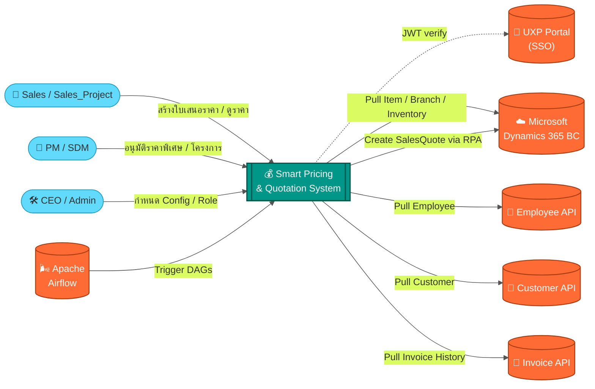

---

## Diagram #2 — Container Diagram

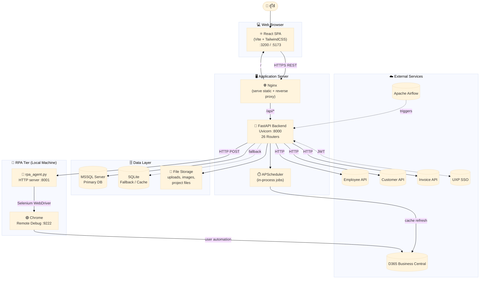

---

## Diagram #3 — Component Diagram Frontend

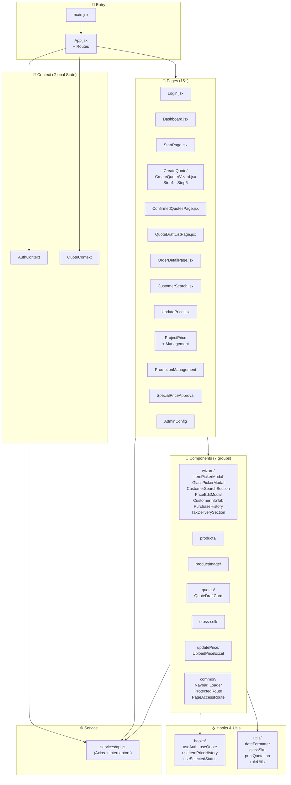

---

## Diagram #4 — Component Diagram Backend

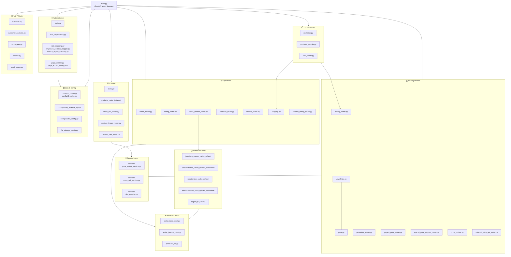


---

## Diagram #5 — Deployment Diagram

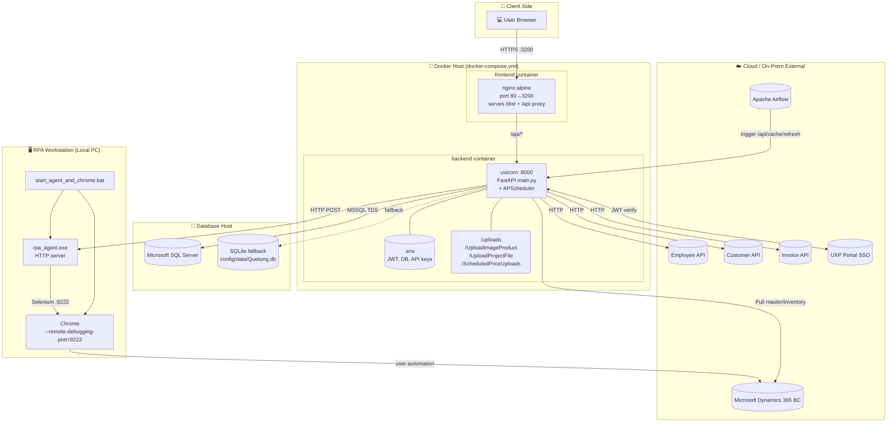

---

## Diagram #6 — Sequence Login

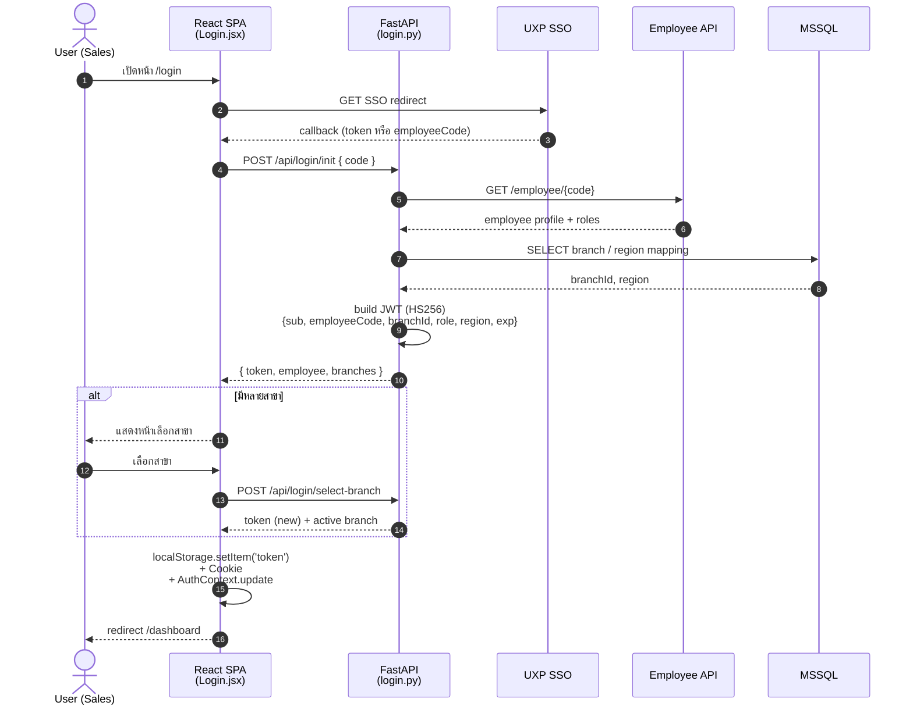

---

## Diagram #7 — Sequence Create Quote

> **หมายเหตุสำคัญ:** ปัจจุบันหน้า CreateQuote เป็น **Single-Page Builder** (ไม่ใช่ wizard แบบแยก step)
> - `CreateQuoteWizard.jsx` เป็นแค่ wrapper บาง ๆ ที่ load drafts แล้ว render `Step6_Summary.jsx`
> - `Step6_Summary.jsx` (~2700 บรรทัด) รวมทุก section ไว้ในหน้าเดียว:
>   - CustomerSearchSection (ค้นหาลูกค้า)
>   - ItemPickerModal, GlassPickerModal (เลือกสินค้า)
>   - Cart & Pricing (คำนวณราคาอัตโนมัติ)
>   - TaxDeliverySection (จัดส่ง)
>   - Summary & Print (สรุปและพิมพ์)

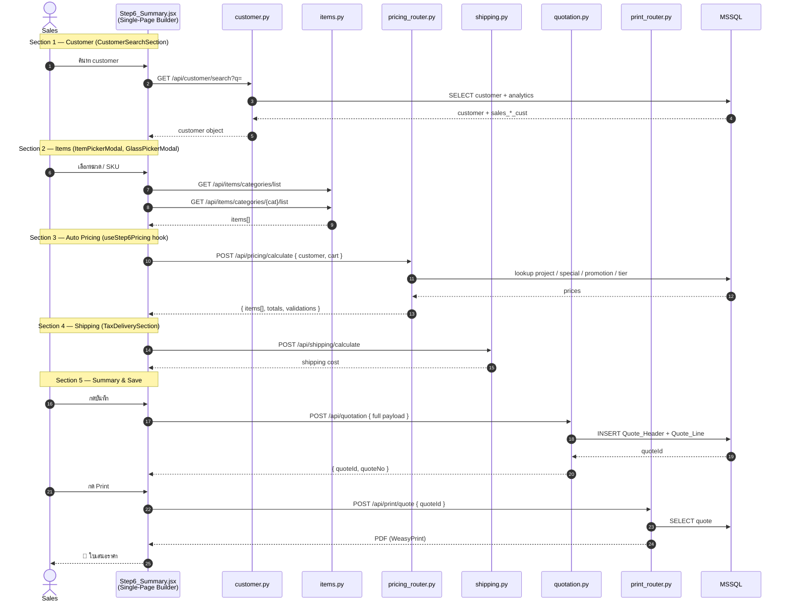

---

## Diagram #8 — Sequence Pricing

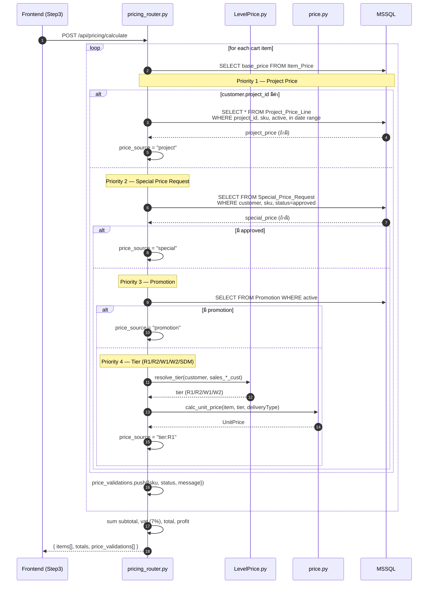

---

## Diagram #9 — Sequence RPA

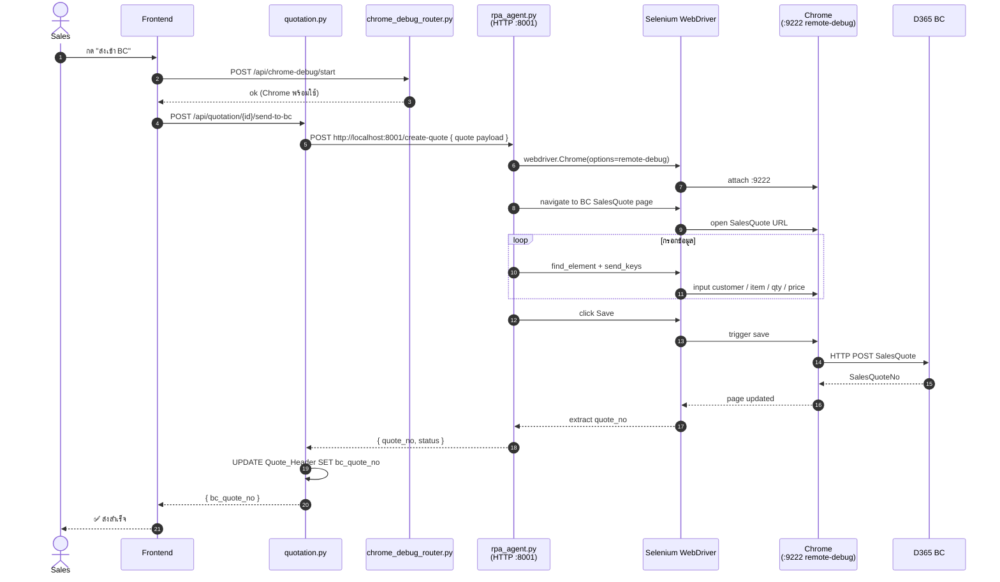

---

## Diagram #10 — Sequence Cache

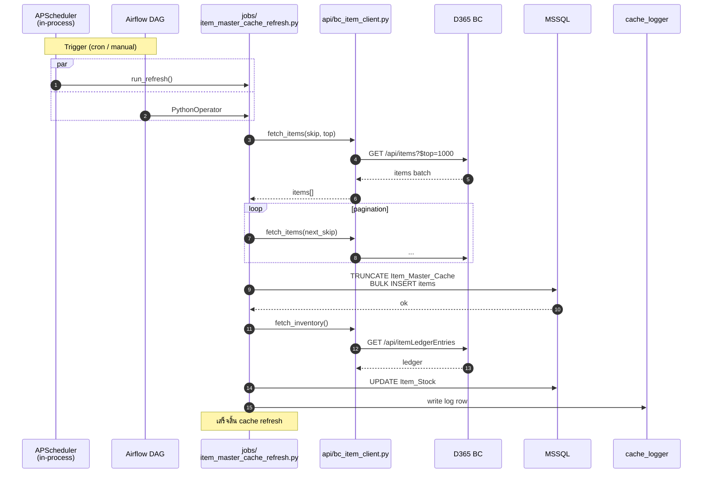


---

## Diagram #11 — Data Flow Diagram

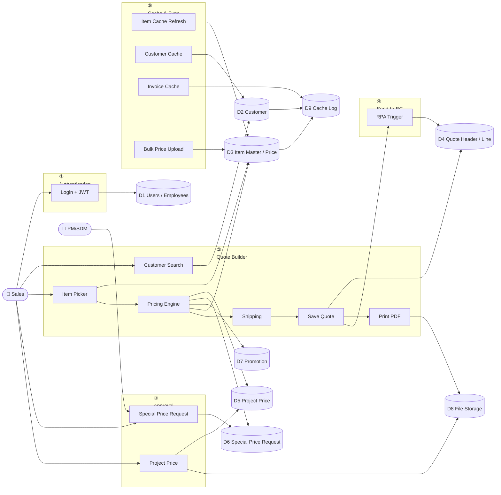

---

## Diagram #12 — ER Diagram

```mermaid
erDiagram
    EMPLOYEE ||--o{ QUOTE_HEADER : creates
    EMPLOYEE }o--|| BRANCH : belongs_to
    BRANCH }o--|| REGION : in
    CUSTOMER ||--o{ QUOTE_HEADER : has
    CUSTOMER ||--o{ PROJECT_PRICE_HEADER : owns
    QUOTE_HEADER ||--|{ QUOTE_LINE : contains
    QUOTE_LINE }o--|| ITEM_MASTER : references
    ITEM_MASTER ||--o| ITEM_PRICE : priced
    ITEM_MASTER ||--o{ ITEM_STOCK : stocked
    PROJECT_PRICE_HEADER ||--|{ PROJECT_PRICE_LINE : has
    PROJECT_PRICE_LINE }o--|| ITEM_MASTER : for
    SPECIAL_PRICE_REQUEST }o--|| ITEM_MASTER : for
    SPECIAL_PRICE_REQUEST }o--|| CUSTOMER : for
    SPECIAL_PRICE_REQUEST }o--|| EMPLOYEE : approver
    PROMOTION ||--o{ PROMOTION_LINE : includes
    CROSS_SELL_RULE }o--|| ITEM_MASTER : maps

    EMPLOYEE {
        string EmployeeCode PK
        string EmployeeName
        string Role
        string BranchId FK
        string Position
        bool   IsActive
    }
    BRANCH {
        string BranchId PK
        string BranchName
        string RegionId FK
    }
    REGION {
        string RegionId PK
        string RegionName
    }
    CUSTOMER {
        string Code PK
        string Name
        string Phone
        string PaymentTerm
        decimal CreditLimit
        decimal sales_g_cust
        decimal sales_a_cust
        decimal sales_s_cust
        decimal accum_6m
        int    frequency
    }
    ITEM_MASTER {
        string SKU PK
        string Description
        string Category
        string Brand
        string Unit
        decimal sqft_sheet
        decimal product_weight
        bool   isVariant
    }
    ITEM_PRICE {
        string SKU PK_FK
        decimal priceR1
        decimal priceR2
        decimal priceW1
        decimal priceW2
        decimal cost
        date   updated_at
    }
    ITEM_STOCK {
        string SKU PK_FK
        string BranchId PK_FK
        decimal available_qty
        decimal reserved_qty
    }
    QUOTE_HEADER {
        int    QuoteId PK
        string QuoteNo
        string CustomerCode FK
        string CreatedByEmployeeCode FK
        string Status
        string DeliveryType
        decimal Subtotal
        decimal VAT
        decimal Total
        string ProjectCode
        string BcQuoteNo
        datetime CreatedAt
    }
    QUOTE_LINE {
        int    LineId PK
        int    QuoteId FK
        string SKU FK
        decimal Qty
        decimal UnitPrice
        decimal Amount
        string PriceSource
    }
    PROJECT_PRICE_HEADER {
        int    project_id PK
        string project_code
        string project_name
        string customer_code FK
        string branch_code FK
        date   price_start_date
        date   price_end_date
        string status
        string CreatedByEmployeeCode
    }
    PROJECT_PRICE_LINE {
        int    line_id PK
        int    project_id FK
        string sku FK
        decimal price
        decimal quantity
    }
    SPECIAL_PRICE_REQUEST {
        int    request_id PK
        string customer_code FK
        string sku FK
        decimal requested_price
        decimal approved_price
        string status
        string requested_by FK
        string approved_by FK
        date   valid_from
        date   valid_to
    }
    PROMOTION {
        int    promo_id PK
        string promo_code
        string promo_name
        date   start_date
        date   end_date
        string status
    }
    PROMOTION_LINE {
        int    line_id PK
        int    promo_id FK
        string sku FK
        decimal discount
    }
    CROSS_SELL_RULE {
        int    rule_id PK
        string sku FK
        string related_sku FK
        string rule_group
    }
```

---

## Diagram #13 — Use Case Diagram

```mermaid
flowchart LR
    subgraph Actors["🧑‍💼 Actors"]
        Sales([Sales])
        SalesPj([Sales_Project])
        PM([PM])
        SDM([SDM])
        CEO([CEO])
        Admin([Admin])
        System([⏱️ Scheduler])
    end

    subgraph UseCases["🎯 Use Cases"]
        UC1((Login / SSO))
        UC2((Search Customer))
        UC3((Create Quotation<br/>Single-Page Builder))
        UC4((Calculate Pricing))
        UC5((Save Draft))
        UC6((Print PDF))
        UC7((Send to BC via RPA))
        UC8((Request Special Price))
        UC9((Approve Special Price))
        UC10((Manage Project Price))
        UC11((Upload Project File))
        UC12((Manage Promotion))
        UC13((Bulk Upload Price Excel))
        UC14((View Dashboard /<br/>Statistics))
        UC15((Cross-sell Suggestion))
        UC16((Manage RBAC /<br/>Page Access))
        UC17((Manage Employees))
        UC18((Refresh Cache<br/>Item / Customer))
        UC19((Reorder / Pre-order))
        UC20((Manage Product Image))
    end

    Sales --> UC1
    Sales --> UC2
    Sales --> UC3
    Sales --> UC4
    Sales --> UC5
    Sales --> UC6
    Sales --> UC7
    Sales --> UC8
    Sales --> UC15
    Sales --> UC19

    SalesPj --> UC10
    SalesPj --> UC11
    SalesPj --> UC3

    PM --> UC9
    PM --> UC10
    PM --> UC12
    PM --> UC13
    PM --> UC14

    SDM --> UC9
    SDM --> UC14

    CEO --> UC14

    Admin --> UC16
    Admin --> UC17
    Admin --> UC18
    Admin --> UC20

    System --> UC18
```

---

## Diagram #14 — State Diagram

### A) Special Price Request Lifecycle

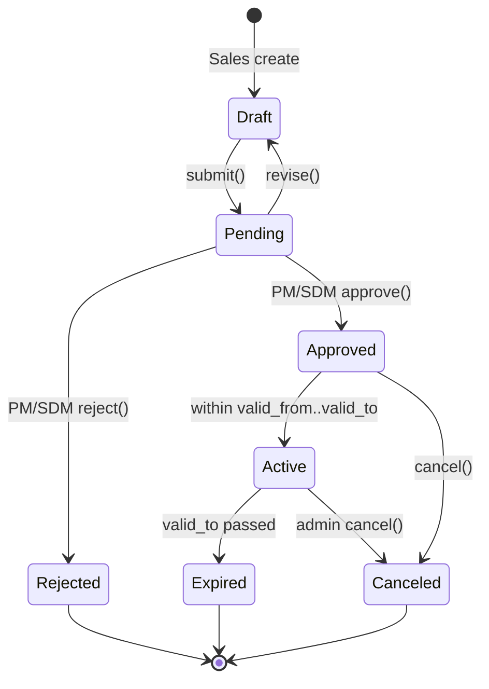

### B) Quote Lifecycle

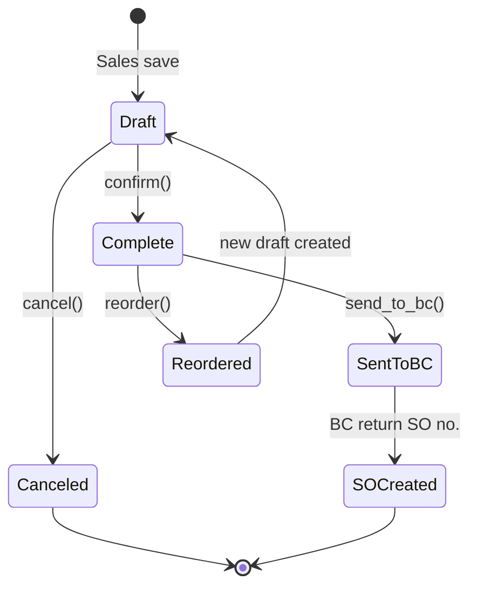

### C) Project Price Lifecycle

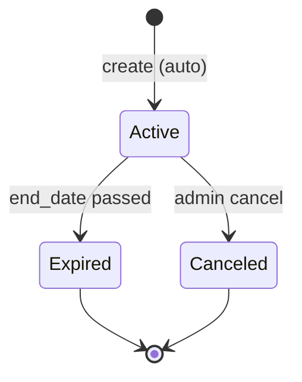


---

## Diagram #15 — API Connection Map

> Map ระดับละเอียดทุก endpoint ของระบบ (เน้น Step6 + กระบวนการหลัก)

```mermaid
flowchart LR
    subgraph FE["⚛️ Frontend"]
        FELogin[Login.jsx]
        FEDash[Dashboard.jsx]
        FEW[Wizard Step1-6]
        FEUpd[UpdatePrice.jsx]
        FEPrj[ProjectPrice<br/>Management.jsx]
        FEPromo[PromotionManagement.jsx]
        FESpa[SpecialPriceApproval.jsx]
        FEAdmin[AdminConfig.jsx]
        FEImg[ProductImageManager.jsx]
        FECustSec[CustomerSearchSection]
        FECross[CrossSellPanel]
        FEHook[useStep6Pricing<br/>useStep6Stock<br/>useStep6History]
    end

    subgraph BE["🐍 Backend Routers"]
        BLogin[login.py]
        BCust[customer.py]
        BItems[items.py]
        BPricing[pricing_router.py]
        BShip[shipping.py]
        BQuote[quotation.py]
        BPrint[print_router.py]
        BPromo[promotion_router.py]
        BProj[project_price_router.py]
        BProjF[project_files_router.py]
        BSPR[special_price_request_router.py]
        BCross[cross_sell_router.py]
        BPriceUpd[price_update.py]
        BConfig[config_router.py]
        BAdmin[admin_router.py]
        BCache[cache_refresh_router.py]
        BStat[statistics_router.py]
        BImg[product_image_router.py]
        BInv[invoice_router.py]
        BCredit[credit_router.py]
        BBranch[branch.py]
        BEmp[employees.py]
        BCustAna[customer_analytics.py]
    end

    FELogin -->|POST /api/login/init<br/>POST /login/select-branch<br/>POST /login/manual<br/>POST /login/logout| BLogin
    FEDash -->|GET /api/statistics/*| BStat
    FEDash -->|GET /api/quotation| BQuote

    FEW -->|GET /api/customer/search| BCust
    FECustSec -->|GET /api/customer/search| BCust
    FEW -->|GET /api/customer-analytics| BCustAna
    FEW -->|GET /api/items/search<br/>GET /api/items/{sku}<br/>GET /api/items/{sku}/stock<br/>GET /api/items/categories/list<br/>GET /api/items/categories/{c}/list| BItems
    FEHook -->|GET /api/items/{sku}/stock| BItems
    FEHook -->|POST /api/pricing/calculate| BPricing
    FEHook -->|GET /api/quotation?status=complete| BQuote
    FEW -->|POST /api/shipping/calculate| BShip
    FEW -->|POST /api/quotation<br/>PUT /api/quotation/{id}<br/>DELETE /api/quotation/{id}<br/>POST /api/quotation/{id}/send-to-bc| BQuote
    FEW -->|POST /api/print/quote<br/>GET  /api/print/quote/{id}| BPrint
    FECross -->|GET /api/cross-sell/rules| BCross
    FEW -->|GET /api/project-prices/by-customer| BProj
    FEW -->|GET /api/credit/{code}| BCredit

    FEUpd -->|POST /api/price-update/upload<br/>GET  /api/price-update/history| BPriceUpd

    FEPrj -->|POST /api/project-prices<br/>GET  /api/project-prices<br/>PUT  /api/project-prices/{id}<br/>DELETE /api/project-prices/{id}| BProj
    FEPrj -->|POST /api/project-files/upload/{code}| BProjF

    FEPromo -->|GET /api/promotion<br/>POST /api/promotion<br/>PUT  /api/promotion/{id}| BPromo

    FESpa -->|GET /api/special-price-request<br/>POST /api/special-price-request<br/>PUT  /api/special-price-request/{id}/approve<br/>PUT  /api/special-price-request/{id}/reject| BSPR

    FEAdmin -->|GET /api/admin/config<br/>PUT /api/admin/config<br/>GET /api/config/page-access/*<br/>PUT /api/config/page-access/*| BAdmin
    FEAdmin --> BConfig
    FEAdmin -->|POST /api/cache/refresh<br/>GET  /api/cache/status| BCache
    FEAdmin -->|GET/POST/PUT /api/employees| BEmp
    FEAdmin -->|GET /api/branch| BBranch
    FEImg -->|POST /api/product-images/upload<br/>GET /api/product-images/{sku}| BImg
```

---

## 19. แนวทางการนำไปใช้

### 🚀 วิธีใช้งาน Mermaid Code

**ออนไลน์ (ง่ายสุด)**
1. ไปที่ <https://mermaid.live>
2. คัดลอก code block (ตั้งแต่ ` ```mermaid ` ถึง ` ``` `) วาง
3. กด Export → SVG / PNG / PDF

**ใน VSCode**
- ติดตั้ง extension **Markdown Preview Mermaid Support**
- เปิดไฟล์ `.md` แล้วกด `Ctrl+Shift+V`

**ใน GitHub / GitLab**
- Mermaid render อัตโนมัติใน README.md, Issues, Wiki

**Export เป็น PDF / SVG ผ่าน CLI**
```bash
npm install -g @mermaid-js/mermaid-cli
mmdc -i DIAGRAM_GENERATION_GUIDE.md -o diagrams.pdf
mmdc -i diagram.mmd -o diagram.svg -t dark
```

### 🎨 ใช้ AI สร้างรูปสวย (Beautiful Diagram)

#### Eraser.io (แนะนำสำหรับ Architecture)
```
ให้ใช้ syntax ของ Eraser.io สร้าง architecture diagram จากคำอธิบายต่อไปนี้:
[paste section "1. ภาพรวมระบบ" + "2.1 Top-Level Project Tree"]
ใช้สีแยก layer และ icon ของ technology จริง (React, FastAPI, MSSQL, Selenium, Docker)
```

#### draw.io / Lucidchart
```
สร้าง XML ของ draw.io สำหรับ deployment diagram โดยใช้ shape:
- mxgraph.aws4 สำหรับ cloud
- mxgraph.docker สำหรับ container
- mxgraph.cisco สำหรับ network
[paste Diagram #5]
```

#### Excalidraw (วาดมือ feel)
- ใช้ <https://excalidraw.com> + plugin **Excalidraw Mermaid to Excalidraw**
- Paste Mermaid → ได้ diagram แบบวาดมือ

### 📐 Diagram Style Guide (สำหรับเอกสารทางการ)

| ประเภท | Tool แนะนำ | Theme |
|---------|-----------|-------|
| Executive Summary | Eraser.io / Excalidraw | Pastel + 3D shadow |
| Technical Doc | Mermaid + GitHub | Default + clean |
| Slide Presentation | draw.io / Figma | Branded color |
| BRD / SRS | PlantUML / Mermaid | Black & white |

### 🎭 ตัวอย่างสีแบ่ง Layer (CSS-like)

```
Frontend  : #61DAFB  (React blue)
Backend   : #009688  (Teal / FastAPI)
Database  : #4479A1  (MSSQL blue)
External  : #FF6B35  (Orange)
RPA       : #FFD600  (Selenium yellow)
Cache/Job : #9C27B0  (Purple)
File      : #795548  (Brown)
User      : #607D8B  (Blue Grey)
```

### ✅ Checklist ตรวจคุณภาพ Diagram

- [ ] ทุก service มีระบุ port + protocol (HTTPS/HTTP/TDS)
- [ ] ทุก arrow มี label (HTTP method + path หรือ message)
- [ ] แยก layer ด้วย subgraph ชัดเจน
- [ ] มี legend หรือคำอธิบายสี
- [ ] ทิศทางลูกศรชัด (one-way / two-way)
- [ ] ครอบคลุม happy path + error path
- [ ] มี actor และ external system ครบ
- [ ] รุ่น/version ของ tech ระบุไว้ (ถ้าสำคัญ)

---

**ผู้จัดทำ:** Smart Pricing Engineering Team
**อัปเดตล่าสุด:** May 2026
**ไฟล์อ้างอิงในโปรเจค:**
- `COMPLETE_SYSTEM_ARCHITECTURE.md`
- `ARCHITECTURE_DIAGRAM_PROMPT.md`
- `PROJECT_SYSTEM_DOCUMENTATION.md`
- `STEP6_API_FLOW_DOCUMENTATION.md`
- `PRICING_CALCULATION_DETAILED_FLOW.md`
- `DETAILED_FILE_CONNECTIONS.md`
