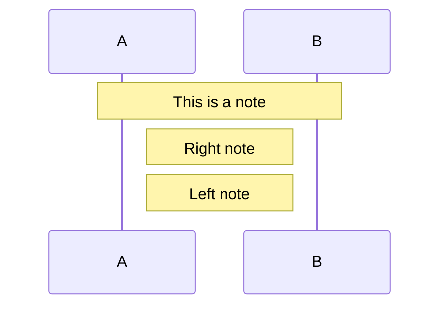

# 🚀 Quick Start: Using the Diagram Documentation

**เอกสารนี้แนะนำวิธีใช้งาน documentation ที่สร้างเสร็จแล้ว**

---

## 📚 เอกสารหลัก 2 ไฟล์

### 1. **API_INVENTORY_AND_SEQUENCE.md** 
**ใช้เมื่อ:** ต้องการดู API endpoints และ sequence diagrams

**เนื้อหา:**
- ✅ **107 API endpoints** แบ่งตาม 12 domains
- ✅ **Frontend ↔ Backend mapping** (หน้าไหนเรียก API อะไร)
- ✅ **15 Sequence Diagrams** พร้อมใช้
- ✅ **Master Prompts** สำหรับสร้าง diagram ด้วย AI

**Use Cases:**
- ต้องการรู้ว่าหน้า CreateQuote เรียก API อะไรบ้าง
- ต้องการเห็น flow การคำนวณราคา (Pricing Priority)
- ต้องการ sequence diagram สำหรับ RPA Send-to-BC
- ต้องการสร้าง diagram ใหม่ด้วย ChatGPT/Claude

---

### 2. **DIAGRAM_GENERATION_GUIDE.md**
**ใช้เมื่อ:** ต้องการดู architecture diagrams และโครงสร้างระบบ

**เนื้อหา:**
- ✅ **โครงสร้างโค้ดทั้งระบบ** (backend 26 routers, frontend 15 pages)
- ✅ **15+ Architecture Diagrams** (C4, Component, Deployment, ER, Use Case, State)
- ✅ **Master Prompt Templates** สำหรับ AI
- ✅ **Cross-Reference Map** (Frontend ↔ Backend)

**Use Cases:**
- ต้องการเห็นภาพรวมระบบ (System Context)
- ต้องการดู deployment architecture (Docker)
- ต้องการเห็น component structure (Frontend/Backend)
- ต้องการ ER diagram ของ database

---

## 🎯 Quick Access by Task

### Task 1: "ต้องการดู API ทั้งหมดที่ระบบมี"
→ เปิด `API_INVENTORY_AND_SEQUENCE.md` → Section 1

### Task 2: "ต้องการรู้ว่าหน้า CreateQuote เรียก API อะไรบ้าง"
→ เปิด `API_INVENTORY_AND_SEQUENCE.md` → Section 2.1 → หา "CreateQuote"

### Task 3: "ต้องการเห็น flow การ Login"
→ เปิด `API_INVENTORY_AND_SEQUENCE.md` → Section 4 → Sequence #1

### Task 4: "ต้องการเห็น flow การคำนวณราคา (Priority)"
→ เปิด `API_INVENTORY_AND_SEQUENCE.md` → Section 4 → Sequence #4

### Task 5: "ต้องการเห็นโครงสร้างโค้ด Backend"
→ เปิด `DIAGRAM_GENERATION_GUIDE.md` → Section 2.2

### Task 6: "ต้องการเห็น System Architecture"
→ เปิด `DIAGRAM_GENERATION_GUIDE.md` → Diagram #1 (System Context)

### Task 7: "ต้องการเห็น Deployment Diagram"
→ เปิด `DIAGRAM_GENERATION_GUIDE.md` → Diagram #5

### Task 8: "ต้องการเห็น Database Schema (ER Diagram)"
→ เปิด `DIAGRAM_GENERATION_GUIDE.md` → Diagram #12

### Task 9: "ต้องการสร้าง Diagram ใหม่ด้วย AI"
→ เปิด `API_INVENTORY_AND_SEQUENCE.md` → Section 3 → คัดลอก Master Prompt

### Task 10: "ต้องการ export diagram เป็นรูป"
→ ดูด้านล่าง "วิธี Render Diagrams"

---

## 🖼️ วิธี Render Diagrams

### วิธีที่ 1: Mermaid Live Editor (แนะนำ)
1. เปิด https://mermaid.live
2. คัดลอก code block จาก documentation (ส่วนที่ขึ้นต้นด้วย ` ```mermaid`)
3. Paste ลงใน editor
4. กด Export → SVG / PNG / PDF

### วิธีที่ 2: VSCode (สำหรับ preview)
1. ติดตั้ง extension: `Markdown Preview Mermaid Support`
2. เปิดไฟล์ .md
3. กด `Ctrl+Shift+V` (Preview)
4. Diagrams จะ render อัตโนมัติ

### วิธีที่ 3: Command Line (Export ทั้งหมด)
```bash
# ติดตั้ง mermaid-cli
npm install -g @mermaid-js/mermaid-cli

# Export ทีละไฟล์
mmdc -i API_INVENTORY_AND_SEQUENCE.md -o api_sequences.pdf
mmdc -i DIAGRAM_GENERATION_GUIDE.md -o architecture_diagrams.pdf

# หรือ export เป็น PNG
mmdc -i API_INVENTORY_AND_SEQUENCE.md -o diagrams/ -e png
```

---

## 🤖 วิธีใช้ Master Prompt กับ AI

### ขั้นตอน:

1. **เปิด AI Tool**
   - ChatGPT (GPT-4)
   - Claude (Sonnet/Opus)
   - Gemini Advanced

2. **คัดลอก Master Prompt**
   - จาก `API_INVENTORY_AND_SEQUENCE.md` Section 3.1
   - หรือ `DIAGRAM_GENERATION_GUIDE.md` Section 3

3. **แก้ไข Prompt**
   - แทนที่ `[ระบุชื่อ flow]` ด้วย flow ที่ต้องการ
   - เช่น: "Login Flow", "Pricing Calculation", "RPA Send-to-BC"

4. **Paste API References**
   - คัดลอก API endpoints ที่เกี่ยวข้องจาก Section 1
   - Paste ต่อท้าย prompt

5. **รับ Output**
   - AI จะสร้าง Mermaid code
   - คัดลอกไปวางใน mermaid.live

### ตัวอย่าง Quick Prompt:

```text
วาด Sequence Diagram flow Login (UXP SSO + Manual + Select Branch) 
แสดง endpoint /api/login/init, /api/login/manual, /api/login/select-branch 
+ JWT generation → Mermaid
```

---

## 📊 Diagram Types Available

### ใน API_INVENTORY_AND_SEQUENCE.md:
1. ✅ Login & Authentication
2. ✅ Dashboard Load
3. ✅ Create Quote (Single-Page Builder)
4. ✅ Pricing Calculation Priority
5. ✅ Special Price Request
6. ✅ Project Price Management
7. ✅ Promotion Management
8. ✅ Bulk Price Upload (Excel)
9. ✅ RPA Send-to-BC
10. ✅ Print Quotation PDF
11. ✅ Reorder
12. ✅ Cache Refresh
13. ✅ Page Access Check (RBAC)
14. ✅ Customer 360
15. ✅ Glass Picker

### ใน DIAGRAM_GENERATION_GUIDE.md:
1. ✅ System Context (C4 Level 1)
2. ✅ Container Diagram (C4 Level 2)
3. ✅ Component Diagram Frontend
4. ✅ Component Diagram Backend
5. ✅ Deployment Diagram
6. ✅ Sequence: Login
7. ✅ Sequence: Create Quote
8. ✅ Sequence: Pricing
9. ✅ Sequence: RPA
10. ✅ Sequence: Cache
11. ✅ Data Flow Diagram
12. ✅ ER Diagram (Database)
13. ✅ Use Case Diagram
14. ✅ State Diagram (Quote/Special Price)
15. ✅ API Connection Map

---

## 🎨 Customizing Diagrams

### เปลี่ยนสี Theme:


**Themes:** `default`, `dark`, `forest`, `neutral`, `base`

### เปลี่ยนทิศทาง:
- `flowchart LR` = Left to Right
- `flowchart TB` = Top to Bottom
- `flowchart RL` = Right to Left
- `flowchart BT` = Bottom to Top

### เพิ่ม Note:


---

## 🔧 Troubleshooting

### ปัญหา: Diagram ไม่ render
**สาเหตุ:** Syntax error
**แก้ไข:** 
- ตรวจสอบ `()` ใน arrow label (ห้ามใช้)
- ตรวจสอบ quote marks `"` ต้องปิดครบ
- ตรวจสอบ indentation

### ปัญหา: ตัวอักษรไทยไม่แสดง
**สาเหตุ:** Font ไม่รองรับ
**แก้ไข:**
- ใช้ mermaid.live (รองรับไทย)
- หรือ export เป็น SVG แล้วเปิดใน browser

### ปัญหา: Diagram ใหญ่เกินไป
**แก้ไข:**
- แยก diagram ออกเป็นหลายส่วน
- ใช้ subgraph เพื่อ group
- Export เป็น SVG (scale ได้)

---

## 📞 Support

**Documentation Created By:** Smart Pricing Engineering Team  
**Last Updated:** May 14, 2026  
**Related Files:**
- `API_INVENTORY_AND_SEQUENCE.md`
- `DIAGRAM_GENERATION_GUIDE.md`
- `DOCUMENTATION_UPDATE_SUMMARY.md`

**Mermaid Documentation:** https://mermaid.js.org/  
**Mermaid Live Editor:** https://mermaid.live

---

**Happy Diagramming! 🎨**
