```mermaid
sequenceDiagram
    %% ===== PARTICIPANTS (UML: Actors & Objects) =====
    actor Sales as 👤 Sales Person
    participant FE as <<boundary>><br/>React Frontend
    participant API as <<control>><br/>FastAPI Backend<br/>:8000
    participant PricingEngine as <<control>><br/>pricing_router.py
    participant DB as <<entity>><br/>MSSQL Database
    participant CreditAPI as <<boundary>><br/>External Credit API
    participant RPA as <<boundary>><br/>RPA Agent<br/>:8001
    participant BC as <<boundary>><br/>Dynamics 365 BC

    %% ===== PHASE 1: Customer Search =====
    rect rgb(230, 245, 255)
        Note over Sales, DB: 【Phase 1】ค้นหาลูกค้า (Customer Search)

        Sales ->>+ FE: 1. พิมพ์รหัส/ชื่อ/เบอร์ลูกค้า
        FE ->>+ API: GET /api/customer/list?q={query}
        API ->>+ DB: SELECT TOP 15 FROM Customer<br/>WHERE code/name/phone LIKE ?
        DB -->>- API: customer_list[]
        API -->>- FE: autocomplete results (max 15)
        FE -->>- Sales: แสดงรายชื่อ dropdown

        Sales ->>+ FE: 2. เลือกลูกค้าจาก dropdown
        FE ->>+ API: GET /api/customer/search?code={code}&product_group={group}
        activate API
        API ->>+ DB: SELECT customer + sales_*_cust + analytics
        DB -->>- API: customer_row
        API ->> API: LevelPrice(customer_df) → คำนวณ Tier

        %% Credit Terms (External API Call)
        API ->>+ CreditAPI: GET /api/external/credit-status/{code}
        CreditAPI -->>- API: { credit_terms }

        API -->>- FE: { id, name, tier, relevantSales,<br/>sales_g/a/s/y/c/e, credit_terms }
        deactivate API
        FE ->> FE: setCustomer(data)
        FE -->>- Sales: แสดงข้อมูลลูกค้า + Tier
    end

    %% ===== PHASE 2: Product Selection =====
    rect rgb(255, 245, 230)
        Note over Sales, DB: 【Phase 2】เลือกสินค้า (Product Selection)

        alt ค้นหาด้วยชื่อ/SKU (Full-Text Search)
            Sales ->>+ FE: 3. พิมพ์ค้นหาสินค้า
            FE ->>+ API: GET /api/items/search?q={keyword}
            API ->>+ DB: FREETEXT / CONTAINS search<br/>Item_Master JOIN Item_Price
            DB -->>- API: items[] (max 50)
            API -->>- FE: items with prices (R1/R2/W1/W2)
            FE -->>- Sales: แสดงรายการสินค้า
        else เลือกจากหมวดหมู่ (Category Browse)
            Sales ->>+ FE: 3. เปิด ItemPickerModal
            FE ->>+ API: GET /api/items/categories/{cat}/list?brand=&group=&offset=0
            API ->>+ DB: SELECT FROM Item_Master<br/>WHERE LEFT(SKU,1) = ? + filters
            DB -->>- API: { items[], total }
            API -->>- FE: paginated items
            FE -->>- Sales: แสดงรายการ + filter options
        else เลือกกระจก (Glass Flow)
            Sales ->>+ FE: 3. เปิด GlassPickerModal
            FE ->>+ API: GET /api/items/categories/G/filter-options
            API -->>- FE: { brands[], types[], colors[], thicknesses[] }
            Sales ->> FE: เลือก brand → type → สี → ความหนา
            FE ->>+ API: GET /api/items/categories/G/list?brand=&color=&thickness=
            API -->>- FE: glass items with sqft_sheet
            FE -->>- Sales: แสดงรายการกระจก + ขนาด
        end

        Sales ->>+ FE: 4. กดเพิ่มสินค้าลงตะกร้า (qty, cut info)
        FE ->> FE: dispatch ADD_TO_CART<br/>{ sku, qty, sqft_sheet, product_weight }
        FE -->>- Sales: อัปเดตตะกร้า
    end

    %% ===== PHASE 3: Price Calculation =====
    rect rgb(230, 255, 230)
        Note over Sales, DB: 【Phase 3】คำนวณราคา (Pricing Calculate API)

        FE ->>+ PricingEngine: POST /api/pricing/calculate
        Note right of FE: Body:<br/>{ customerData: { code, tier,<br/>  sales_*_cust, project_id },<br/>  deliveryType: "PICKUP"|"DELIVERY",<br/>  needTaxInvoice: bool,<br/>  cart: [{ sku, qty, sqft_sheet,<br/>    product_weight, isSoldByPack }] }

        activate PricingEngine
        PricingEngine ->>+ DB: SELECT Item_Master JOIN Item_Price<br/>WHERE SKU IN (cart_skus) AND BranchCode = ?
        DB -->>- PricingEngine: item prices (R1/R2/W1/W2/SDM/RE)

        loop สำหรับแต่ละ item ใน cart
            %% Priority 1: Special Price
            PricingEngine ->>+ DB: SELECT FROM special_price_request_items<br/>WHERE customer & sku & status='APPROVED'<br/>& valid_from ≤ TODAY ≤ valid_to
            DB -->>- PricingEngine: special_price or NULL

            alt มี Special Price (approved & valid)
                PricingEngine ->> PricingEngine: price_source = "special"<br/>NewPrice = special_price
            else ไม่มี Special Price
                %% Priority 2: Project Price
                opt มี project_id
                    PricingEngine ->>+ DB: SELECT FROM Project_Price_Line<br/>WHERE project_id & sku
                    DB -->>- PricingEngine: project_price or NULL
                    alt มี Project Price
                        PricingEngine ->> PricingEngine: price_source = "project"<br/>NewPrice = project_price
                    end
                end

                alt ไม่มี Project/Special Price
                    %% Priority 3: History Price
                    PricingEngine ->>+ DB: SELECT TOP 1 Unit_Price FROM Invoice<br/>WHERE sku & customer & date ≥ 6mo ago<br/>ORDER BY Posting_Date DESC
                    DB -->>- PricingEngine: last_price or NULL
                    alt History price > System price
                        PricingEngine ->> PricingEngine: price_source = "history"<br/>NewPrice = history_price
                    else ใช้ราคาระบบ
                        %% Priority 4: System (Tier) Price
                        PricingEngine ->> PricingEngine: LevelPrice(customer) → Tier Z
                        PricingEngine ->> PricingEngine: Price(df) → tier-based pricing<br/>(R1/R2/W1/W2/SDM)
                        PricingEngine ->> PricingEngine: price_source = "system"
                    end
                end
            end

            %% Unit Price Calculation
            alt category = "A" (Aluminium)
                PricingEngine ->> PricingEngine: UnitPrice = NewPrice × product_weight
            else category = "G" (Glass) & !isSoldByPack
                PricingEngine ->> PricingEngine: UnitPrice = NewPrice × sqft_sheet
            else อื่นๆ
                PricingEngine ->> PricingEngine: UnitPrice = round_up_050(NewPrice)
            end

            PricingEngine ->> PricingEngine: LineTotal = UnitPrice × Quantity
        end

        PricingEngine ->> PricingEngine: subtotal = Σ LineTotal + shippingCustomerPay<br/>exVat = subtotal ÷ 1.07<br/>vat = subtotal - exVat<br/>profit = Σ (price - cost) × qty

        %% Price Validation
        PricingEngine ->> PricingEngine: validate manual prices:<br/>check against R1/W2/W1/SDM thresholds<br/>→ price_validations[]

        PricingEngine -->>- FE: { items[], totals{}, customer_tier,<br/>  price_validations[] }
        deactivate PricingEngine

        FE ->> FE: setCalculation(result)<br/>แสดงราคาในตะกร้า
    end

    %% ===== PHASE 4: Shipping Calculation =====
    rect rgb(255, 240, 245)
        Note over Sales, API: 【Phase 4】คำนวณค่าขนส่ง (Shipping — optional)

        opt deliveryType = "DELIVERY"
            Sales ->>+ FE: 5. เลือกรถ + ระยะทาง + เวลาลง
            FE ->>+ API: POST /api/shipping/calculate_from_cart
            Note right of FE: Body:<br/>{ vehicle_type, distance_km,<br/>  unload_hours, staff_count,<br/>  location_code,<br/>  cart: [{ sku, qty, price,<br/>    product_weight, sqft_sheet }] }

            API ->>+ DB: SELECT Product_Weight FROM Item_Master<br/>WHERE SKU IN (cart_skus)
            DB -->>- API: item weights

            loop สำหรับแต่ละ item
                API ->>+ CreditAPI: POST /api/itemcost<br/>{ Item_No, Location_Code }
                CreditAPI -->>- API: { Unit_Cost }
            end

            API ->> API: compute profit from cart<br/>shipping_cost = fuel + fix + labor<br/>cap = profit × 5%<br/>company_pay = min(cost, cap)<br/>customer_pay = cost - company_pay

            API -->>- FE: { shipping_cost, company_pay,<br/>  customer_pay, profit_for_shipping }
            FE ->> FE: update totals with shipping
            FE -->>- Sales: แสดงค่าขนส่ง

            %% Re-calculate pricing with shipping
            FE ->>+ PricingEngine: POST /api/pricing/calculate<br/>(with shippingCustomerPay)
            PricingEngine -->>- FE: updated totals
        end
    end

    %% ===== PHASE 5: Save Quotation =====
    rect rgb(245, 240, 255)
        Note over Sales, DB: 【Phase 5】บันทึกใบเสนอราคา (Save Quotation)

        Sales ->>+ FE: 6. กด "บันทึก" / "ยืนยัน"
        FE ->> FE: validate: customer? cart? prices?

        break ถ้า validation ไม่ผ่าน
            FE -->> Sales: แสดง error message
        end

        alt สร้างใหม่ (Create)
            FE ->>+ API: POST /quotation
            Note right of FE: Body:<br/>{ employee: { id, name, branchId },<br/>  customer: { code, name, phone, tax_no },<br/>  status: "draft"|"complete",<br/>  deliveryType, needTaxInvoice,<br/>  paymentTerm, creditTerm,<br/>  pre_order, required_delivery_date,<br/>  project_code, ibtBranch,<br/>  cart: [{ sku, name, qty, price,<br/>    lineTotal, sqft_sheet, variantCode,<br/>    product_weight, isGlassCut, cutInfo }],<br/>  totals: { grandTotal, exVat, shippingRaw,<br/>    shippingCustomerPay },<br/>  discount, remark, note }
            API ->> API: _generate_quote_no(branch, ibt)<br/>Format: BSQT-{yyMM}/{seq}
            API ->>+ DB: INSERT INTO Quote_Header (...)<br/>VALUES (...)
            DB -->>- API: ok

            loop สำหรับแต่ละ cart item
                API ->>+ DB: INSERT INTO Quote_Line (...)<br/>VALUES (quote_no, sku, qty, price, ...)
                DB -->>- API: ok
            end

            API ->> DB: COMMIT
            API -->>- FE: { quoteNo: "BSQT-6805/0001", status }
        else อัปเดต Draft (Update)
            FE ->>+ API: PUT /quotation/{quote_no}
            API ->>+ DB: UPDATE Quote_Header SET ...<br/>WHERE QuoteNo = ?
            DB -->>- API: ok
            API ->>+ DB: DELETE FROM Quote_Line WHERE QuoteID = ?
            DB -->>- API: ok
            loop insert new lines
                API ->>+ DB: INSERT INTO Quote_Line (...)
                DB -->>- API: ok
            end
            API ->> DB: COMMIT
            API -->>- FE: { quoteNo, status }
        end

        FE ->> FE: dispatch SET_QUOTE_NO
        FE -->>- Sales: ✅ บันทึกสำเร็จ (แสดง quoteNo)
    end

    %% ===== PHASE 6: Print =====
    rect rgb(240, 255, 240)
        Note over Sales, API: 【Phase 6】พิมพ์ใบเสนอราคา (Print — optional)

        opt Sales กดพิมพ์
            Sales ->>+ FE: 7. กด "พิมพ์"
            alt Frontend PDF (pdf-lib)
                FE ->> FE: load template + TH fonts<br/>pdf-lib: draw header/table/footer
                FE -->> Sales: download PDF locally
            else Backend PDF (WeasyPrint)
                FE ->>+ API: POST /api/print/quotation<br/>{ quoteNo, customer, items, totals }
                API ->> API: Jinja2 template → HTML<br/>WeasyPrint → PDF
                API -->>- FE: PDF blob (application/pdf)
                FE -->> Sales: download PDF
            end
            deactivate FE
        end
    end

    %% ===== PHASE 7: Send to RPA → Dynamics 365 BC =====
    rect rgb(255, 250, 230)
        Note over Sales, BC: 【Phase 7】ส่งเข้า Dynamics 365 BC ผ่าน RPA

        opt Sales กด "ส่งเข้า BC"
            Sales ->>+ FE: 8. กด "ส่งเข้า Dynamics 365"
            FE ->> FE: open ConfirmModal
            Sales ->> FE: confirm ยืนยัน

            %% Start Chrome debug
            FE ->>+ API: POST /api/chrome-debug/start
            API ->> API: spawn Chrome --remote-debugging-port=9222
            API -->>- FE: { ok: true, port: 9222 }

            %% Send to RPA Agent
            FE ->>+ RPA: POST http://localhost:8001/create-quote
            Note right of FE: Body:<br/>{ quote_code: "TRQT-6805/0001",<br/>  customer_no: "08015AY",<br/>  sales_admin: "20614",<br/>  your_reference: quote_no,<br/>  project_code: "PRJ001",<br/>  items: [{ sku, qty, unit_price }] }

            activate RPA
            RPA ->> RPA: convert_quote_code("TRQT") → "TRSQ-QT"
            RPA ->>+ BC: Selenium: attach Chrome :9222<br/>navigate to Sales Quotes page
            BC -->>- RPA: page loaded

            RPA ->>+ BC: Step 1: click "+New" button
            BC -->>- RPA: new form opened
            RPA ->>+ BC: Step 2: click "Review No." → select series
            BC -->>- RPA: series selected
            RPA ->>+ BC: Step 3: fill Customer No. + Enter
            BC -->>- RPA: customer loaded (5s wait)

            opt has project_code
                RPA ->>+ BC: Step 4: fill Project Code + Enter
                BC -->>- RPA: project set
            end

            RPA ->>+ BC: Step 5: select Sales Admin
            BC -->>- RPA: admin set
            RPA ->>+ BC: Step 6: fill Your Reference (quoteNo)
            BC -->>- RPA: reference set

            loop สำหรับแต่ละ line item
                RPA ->>+ BC: Step 7: add line (SKU + Qty + Price)
                BC -->>- RPA: line added
            end

            RPA ->>+ BC: Step 8: Save (Ctrl+S)
            BC -->>- RPA: saved → BC Quote No generated
            deactivate RPA

            RPA -->>- FE: { status: "ok",<br/>  bc_quote_no: "SQ-00123" }

            %% Update local DB with BC reference
            FE ->>+ API: PUT /quotation/{quote_no}<br/>{ bc_quote_no: "SQ-00123" }
            API ->>+ DB: UPDATE Quote_Header<br/>SET bc_quote_no = ? WHERE QuoteNo = ?
            DB -->>- API: ok
            API -->>- FE: ok

            FE -->>- Sales: ✅ ส่งเข้า BC สำเร็จ<br/>เลขที่: SQ-00123
        end
    end
```

# 📊 Quotation Flow — UML Sequence Diagram (Full Notation)

> **Flow ปกติ:** ค้นหาลูกค้า → เลือกสินค้า → คำนวณราคา → บันทึก → ส่ง RPA  
> **UML Notation:** Synchronous (→), Asynchronous (⇢), Return (-->>), Activation Bars, Fragments (alt/opt/loop/par/break)

---



---

## 📋 UML Notation Legend

| สัญลักษณ์ | ความหมาย |
|-----------|----------|
| `->>+` | Synchronous message + activate lifeline |
| `-->>-` | Return message + deactivate lifeline |
| `->>` | Synchronous message (ไม่ activate) |
| `-->>` | Return / Reply message |
| `activate` / `deactivate` | Activation bar (execution focus) |
| `alt ... else ... end` | Alternative fragment (if/else) |
| `opt ... end` | Optional fragment (if only) |
| `loop ... end` | Loop fragment (iteration) |
| `break ... end` | Break fragment (exit condition) |
| `rect rgb(...)` | Grouping / Interaction region |
| `Note over/right` | UML Note annotation |
| `actor` | UML Actor (human/external) |
| `participant` | UML Object (system component) |
| `<<boundary>>` | UML Stereotype — boundary class |
| `<<control>>` | UML Stereotype — control class |
| `<<entity>>` | UML Stereotype — entity class |

---

## 📊 API Summary (ตามลำดับ Flow)

| # | Endpoint | Method | Phase | คำอธิบาย |
|---|----------|--------|-------|----------|
| 1 | `/api/customer/list?q=` | GET | ค้นหาลูกค้า | Autocomplete dropdown (max 15) |
| 2 | `/api/customer/search?code=&product_group=` | GET | ค้นหาลูกค้า | ดึงข้อมูลเต็ม + Tier + Credit |
| 3 | `/api/items/search?q=` | GET | เลือกสินค้า | Full-Text Search |
| 4 | `/api/items/categories/{cat}/list` | GET | เลือกสินค้า | Browse by category + filter |
| 5 | `/api/items/categories/{cat}/filter-options` | GET | เลือกสินค้า | Cascading filter values |
| 6 | `/api/pricing/calculate` | POST | คำนวณราคา | **Main pricing engine** |
| 7 | `/api/shipping/calculate_from_cart` | POST | ค่าขนส่ง | คำนวณค่าขนส่งจาก cart |
| 8 | `POST /quotation` | POST | บันทึก | สร้างใบเสนอราคาใหม่ |
| 9 | `PUT /quotation/{no}` | PUT | บันทึก | อัปเดต draft |
| 10 | `/api/print/quotation` | POST | พิมพ์ | Generate PDF |
| 11 | `/api/chrome-debug/start` | POST | ส่ง RPA | เปิด Chrome debug mode |
| 12 | `http://localhost:8001/create-quote` | POST | ส่ง RPA | RPA สร้างใบเสนอราคาใน BC |

---

## 🔑 Pricing Priority (ลำดับการเลือกราคา)

```
1. Special Price (approved & valid date range)  ← สูงสุด
2. Project Price (ถ้ามี project_id)
3. History Price (ราคาล่าสุด 6 เดือน ถ้าสูงกว่าระบบ)
4. System/Tier Price (LevelPrice → R1/R2/W1/W2/SDM)  ← fallback
```

---

**Created:** May 22, 2026  
**Source:** Backend routers (`customer.py`, `pricing_router.py`, `quotation.py`, `shipping.py`, `rpa_agent.py`)
