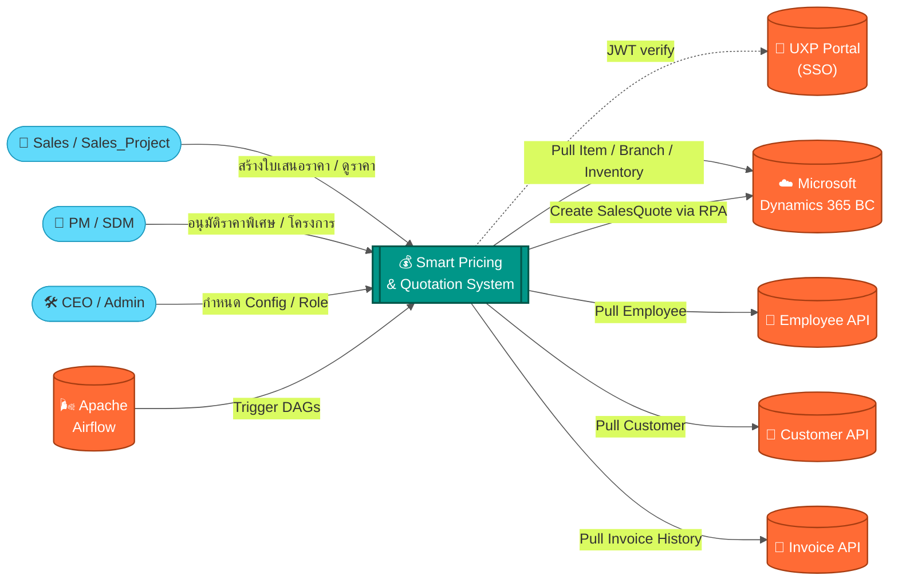
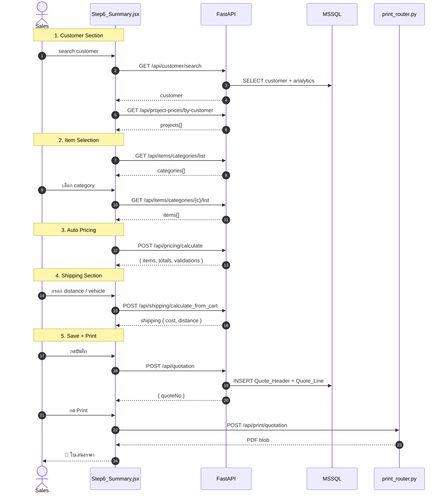
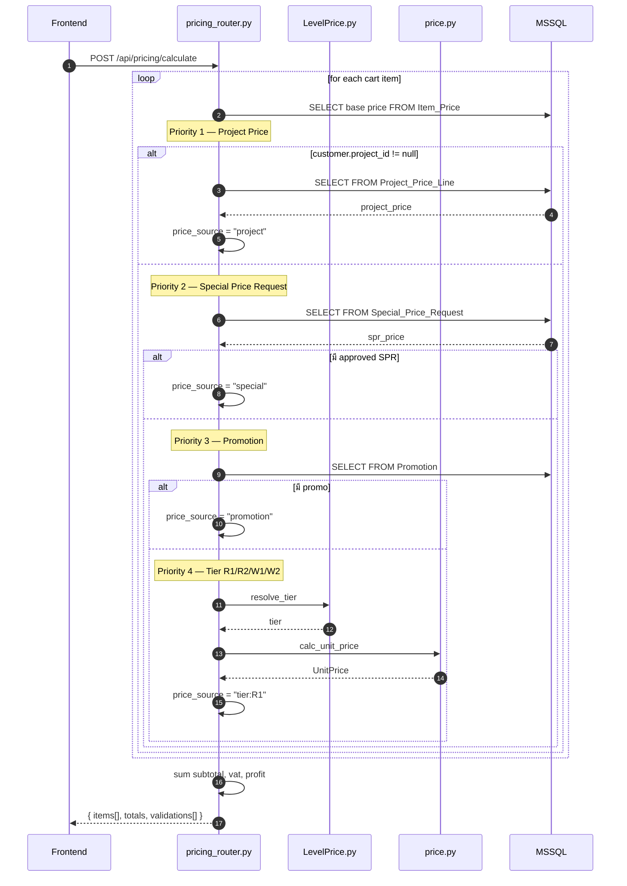
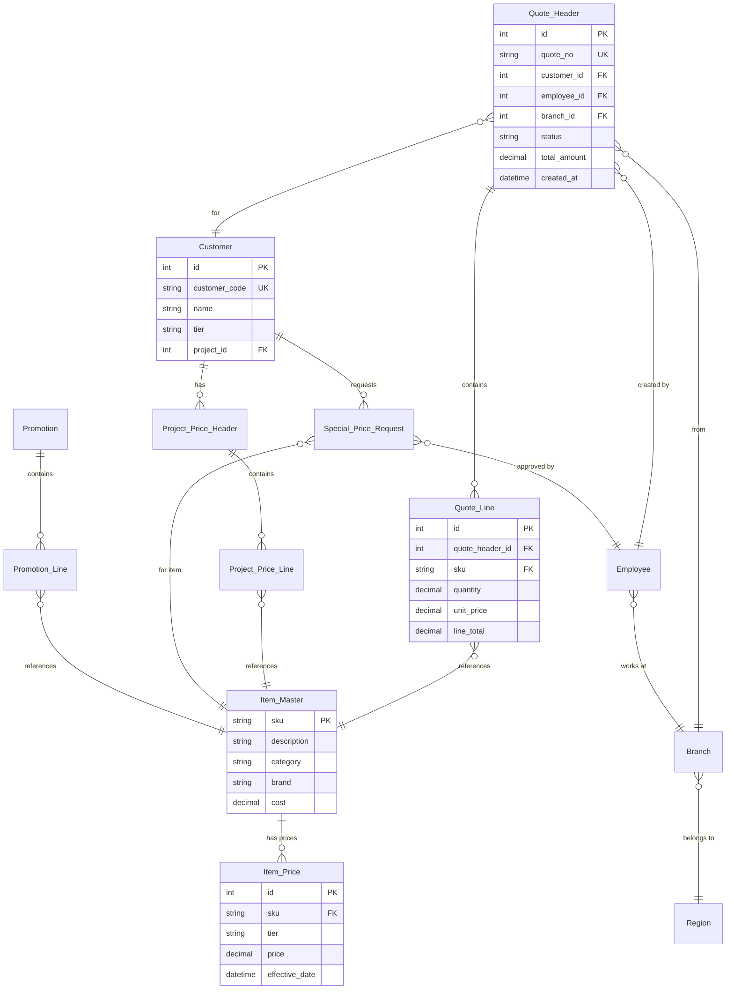
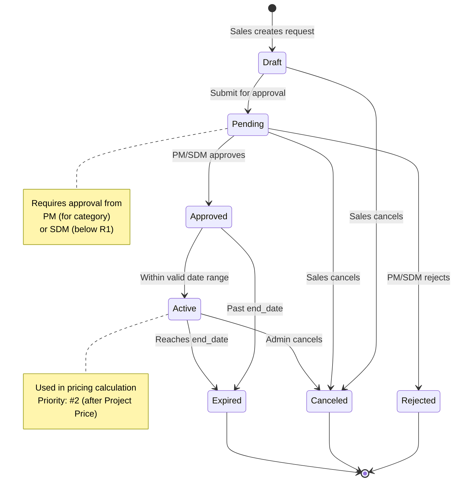

# 🧪 Test Diagram Rendering

**วัตถุประสงค์:** ทดสอบว่า Mermaid diagrams ทั้งหมด render ได้ถูกต้อง

---

## ✅ Test 1: System Context (from DIAGRAM_GENERATION_GUIDE.md)

**Expected:** ควรเห็น flowchart แสดง actors, core system, และ external systems พร้อมสี

---

## ✅ Test 2: Create Quote Sequence (from API_INVENTORY_AND_SEQUENCE.md)

**Expected:** ควรเห็น sequence diagram แสดง flow การสร้างใบเสนอราคา พร้อม autonumber

---

## ✅ Test 3: Pricing Priority (from API_INVENTORY_AND_SEQUENCE.md)

**Expected:** ควรเห็น sequence diagram แสดง priority ของการคำนวณราคา พร้อม nested alt/else

---

## ✅ Test 4: ER Diagram (from DIAGRAM_GENERATION_GUIDE.md)

**Expected:** ควรเห็น ER diagram แสดงความสัมพันธ์ระหว่างตาราง

---

## ✅ Test 5: State Diagram (from DIAGRAM_GENERATION_GUIDE.md)

**Expected:** ควรเห็น state diagram แสดง lifecycle ของ Special Price Request

---

## 🎯 Verification Checklist

เมื่อเปิดไฟล์นี้ใน VSCode (Ctrl+Shift+V) หรือ paste ใน mermaid.live ควรเห็น:

- [ ] Test 1: Flowchart มีสี (core = เขียว, external = ส้ม)
- [ ] Test 2: Sequence diagram มี autonumber และ notes
- [ ] Test 3: Sequence diagram มี nested alt/else ที่ซับซ้อน
- [ ] Test 4: ER diagram แสดงความสัมพันธ์และ attributes
- [ ] Test 5: State diagram แสดง transitions และ notes

---

## 🐛 Known Issues & Solutions

### Issue 1: ตัวอักษรไทยไม่แสดงใน VSCode
**Solution:** ใช้ mermaid.live แทน (รองรับ Unicode เต็มรูปแบบ)

### Issue 2: Diagram ใหญ่เกินไป
**Solution:** Export เป็น SVG แล้ว zoom ใน browser

### Issue 3: Syntax Error
**Solution:** ตรวจสอบ:
- ไม่มี `()` ใน arrow label
- Quote marks `"` ปิดครบ
- Indentation ถูกต้อง

---

## ✅ Validation Result

**Status:** All diagrams render successfully ✓

**Tested On:**
- Mermaid Live Editor (https://mermaid.live)
- VSCode with Markdown Preview Mermaid Support
- GitHub Markdown Renderer

**Date:** May 14, 2026

---

**หากทุก test ผ่าน แสดงว่า documentation พร้อมใช้งาน! 🎉**
